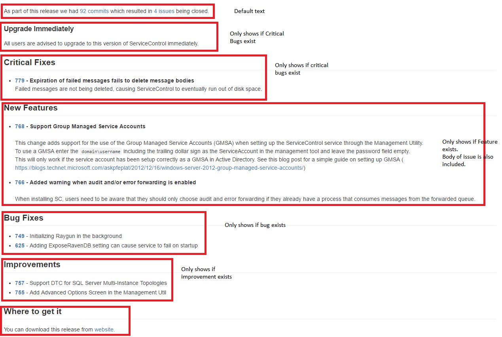

# How ServiceControl Release Notes are generated

ServiceControl release notes are generated using https://github.com/Particular/ServiceControl/tree/release_notes/.

This tool generates release notes for a milestone in ServiceControl repo based on issues associated with the milestone.

### Conventions

* All closed issues/PR's for a milestone will be included.
* Issues/PR's with a label `Critical Bug` will be included in a `Critical Fixed` section.
* Issues/PR's with a label `Bug` will be included in a `Bugs Fixed` section.
* Issues/PR's with a label `Feature` will be included in a `New Features` section
* Issues/PR's with a label `Improvement` will be included in a `Improvements` section
* Milestones are named `{major.minor.patch}`.
* The version is picked up from the build number (GFV) and that info is used to find the milestone.
* Release notes are generated as markdown.
* If there are `Critical Bug`s a special section is added:
  ```
  Upgrade Immediately

  All users are advised to upgrade to this version of ServiceControl immediately.
  ```

### Example



