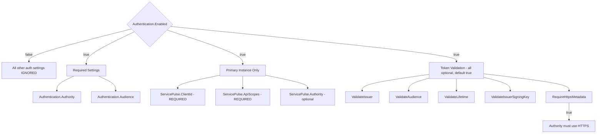

# Authentication

See [ServiceControl Authentication](https://docs.particular.net/servicecontrol/security/configuration/authentication) on the public docs site.

## Configuration Dependency Map

The authentication settings have dependencies on each other. The following table shows which settings require other settings to be enabled for them to take effect.

### Master Switch

| Setting                  | Description                                                                             |
|--------------------------|-----------------------------------------------------------------------------------------|
| `Authentication.Enabled` | **Master switch** - All other authentication settings are ignored unless this is `true` |

### Required Settings (when `Authentication.Enabled = true`)

| Setting                    | Required | Description                                         |
|----------------------------|----------|-----------------------------------------------------|
| `Authentication.Authority` | **Yes**  | The OpenID Connect authority URL. Must be provided. |
| `Authentication.Audience`  | **Yes**  | The expected audience in tokens. Must be provided.  |

### Validation Settings (optional, all default to `true`)

These settings only take effect when `Authentication.Enabled = true`. They control how JWT tokens are validated:

| Setting                                   | Default | Effect when `false`                                             |
|-------------------------------------------|---------|-----------------------------------------------------------------|
| `Authentication.ValidateIssuer`           | `true`  | Tokens from any issuer accepted (security warning logged)       |
| `Authentication.ValidateAudience`         | `true`  | Tokens for any audience accepted (security warning logged)      |
| `Authentication.ValidateLifetime`         | `true`  | Expired tokens accepted (security warning logged)               |
| `Authentication.ValidateIssuerSigningKey` | `true`  | Token signatures not verified (security warning logged)         |
| `Authentication.RequireHttpsMetadata`     | `true`  | HTTP authority URLs allowed (blocks HTTPS validation if `true`) |

### ServicePulse Settings (Primary instance only)

These are required only on the **primary ServiceControl instance** (not Audit or Monitoring):

| Setting                                 | Required | Description                                                      |
|-----------------------------------------|----------|------------------------------------------------------------------|
| `Authentication.ServicePulse.ClientId`  | **Yes**  | OAuth client ID for ServicePulse                                 |
| `Authentication.ServicePulse.ApiScopes` | **Yes**  | API scopes ServicePulse should request                           |
| `Authentication.ServicePulse.Authority` | No       | Override authority for ServicePulse (defaults to main Authority) |

### Dependency Diagram

## See Also

- [Authentication Testing](authentication-testing.md) - Testing authentication locally
