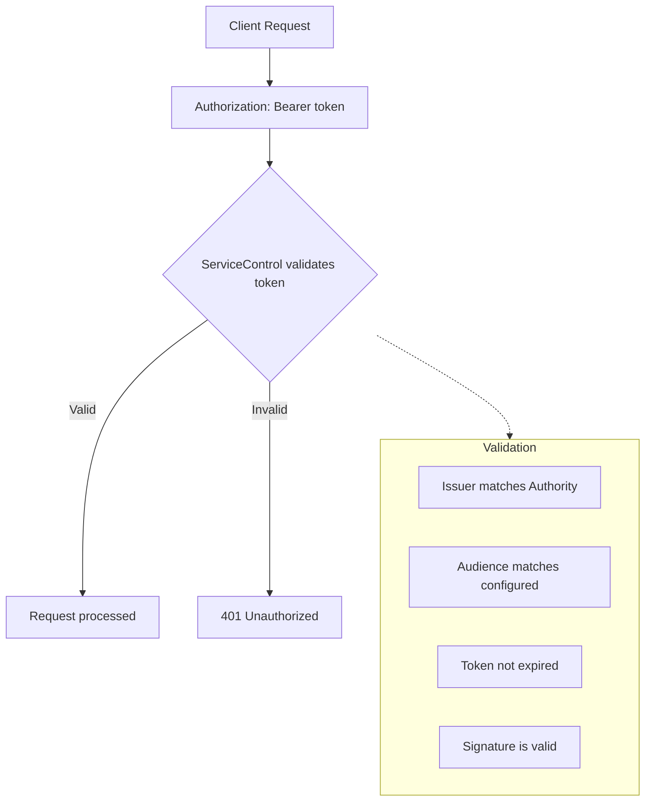

# Authentication Configuration

ServiceControl instances can be configured to require JWT authentication using OpenID Connect (OIDC). This enables integration with identity providers like Microsoft Entra ID (Azure AD), Okta, Auth0, and other OIDC-compliant providers.

## Configuration

ServiceControl instances can be configured via environment variables or App.config. Each instance type uses a different prefix.

### Environment Variables

| Instance                  | Prefix                  |
|---------------------------|-------------------------|
| ServiceControl (Primary)  | `SERVICECONTROL_`       |
| ServiceControl.Audit      | `SERVICECONTROL_AUDIT_` |
| ServiceControl.Monitoring | `MONITORING_`           |

#### Core Settings

| Setting                            | Default | Description                                                                               |
|------------------------------------|---------|-------------------------------------------------------------------------------------------|
| `{PREFIX}AUTHENTICATION_ENABLED`   | `false` | Enable JWT authentication                                                                 |
| `{PREFIX}AUTHENTICATION_AUTHORITY` | (none)  | OpenID Connect authority URL (e.g., `https://login.microsoftonline.com/{tenant-id}/v2.0`) |
| `{PREFIX}AUTHENTICATION_AUDIENCE`  | (none)  | The audience identifier (typically your API identifier or client ID)                      |

#### Validation Settings

| Setting                                           | Default | Description                              |
|---------------------------------------------------|---------|------------------------------------------|
| `{PREFIX}AUTHENTICATION_VALIDATEISSUER`           | `true`  | Validate the token issuer                |
| `{PREFIX}AUTHENTICATION_VALIDATEAUDIENCE`         | `true`  | Validate the token audience              |
| `{PREFIX}AUTHENTICATION_VALIDATELIFETIME`         | `true`  | Validate token expiration                |
| `{PREFIX}AUTHENTICATION_VALIDATEISSUERSIGNINGKEY` | `true`  | Validate the signing key                 |
| `{PREFIX}AUTHENTICATION_REQUIREHTTPSMETADATA`     | `true`  | Require HTTPS for OIDC metadata endpoint |

#### ServicePulse Settings (Primary Instance Only)

These settings are required on the primary ServiceControl instance to provide authentication configuration to ServicePulse clients.

| Setting                                         | Default | Description                                                                                            |
|-------------------------------------------------|---------|--------------------------------------------------------------------------------------------------------|
| `{PREFIX}AUTHENTICATION_SERVICEPULSE_CLIENTID`  | (none)  | Client ID for ServicePulse application                                                                 |
| `{PREFIX}AUTHENTICATION_SERVICEPULSE_AUTHORITY` | (none)  | Authority URL for ServicePulse (defaults to main Authority if not set)                                 |
| `{PREFIX}AUTHENTICATION_SERVICEPULSE_APISCOPES` | (none)  | JSON array of API scopes for ServicePulse to request (e.g., `["api://servicecontrol/access_as_user"]`) |

### App.config

| Instance                  | Key Prefix              |
|---------------------------|-------------------------|
| ServiceControl (Primary)  | `ServiceControl/`       |
| ServiceControl.Audit      | `ServiceControl.Audit/` |
| ServiceControl.Monitoring | `Monitoring/`           |

```xml
<appSettings>
  <!-- Core Authentication Settings -->
  <add key="ServiceControl/Authentication.Enabled" value="true" />
  <add key="ServiceControl/Authentication.Authority" value="https://login.microsoftonline.com/{tenant-id}/v2.0" />
  <add key="ServiceControl/Authentication.Audience" value="api://servicecontrol" />

  <!-- Validation Settings (defaults shown - recommended for production) -->
  <add key="ServiceControl/Authentication.ValidateIssuer" value="true" />
  <add key="ServiceControl/Authentication.ValidateAudience" value="true" />
  <add key="ServiceControl/Authentication.ValidateLifetime" value="true" />
  <add key="ServiceControl/Authentication.ValidateIssuerSigningKey" value="true" />
  <add key="ServiceControl/Authentication.RequireHttpsMetadata" value="true" />

  <!-- ServicePulse Settings (Primary Instance Only) -->
  <add key="ServiceControl/Authentication.ServicePulse.ClientId" value="{servicepulse-client-id}" />
  <add key="ServiceControl/Authentication.ServicePulse.ApiScopes" value="["api://servicecontrol/access_as_user"]" />
</appSettings>
```

## Examples

### Microsoft Entra ID (Azure AD)

```cmd
set SERVICECONTROL_AUTHENTICATION_ENABLED=true
set SERVICECONTROL_AUTHENTICATION_AUTHORITY=https://login.microsoftonline.com/{tenant-id}/v2.0
set SERVICECONTROL_AUTHENTICATION_AUDIENCE=api://servicecontrol
set SERVICECONTROL_AUTHENTICATION_SERVICEPULSE_CLIENTID={servicepulse-client-id}
set SERVICECONTROL_AUTHENTICATION_SERVICEPULSE_APISCOPES=["api://servicecontrol/access_as_user"]
```

### Docker Example

```cmd
docker run -p 33333:33333 -e SERVICECONTROL_AUTHENTICATION_ENABLED=true -e SERVICECONTROL_AUTHENTICATION_AUTHORITY=https://login.microsoftonline.com/{tenant-id}/v2.0 -e SERVICECONTROL_AUTHENTICATION_AUDIENCE=api://servicecontrol -e SERVICECONTROL_AUTHENTICATION_SERVICEPULSE_CLIENTID={servicepulse-client-id} -e SERVICECONTROL_AUTHENTICATION_SERVICEPULSE_APISCOPES=["api://servicecontrol/access_as_user"] particular/servicecontrol:latest
```

### Audit and Monitoring Instances

Audit and Monitoring instances don't require ServicePulse settings:

```cmd
set SERVICECONTROL_AUDIT_AUTHENTICATION_ENABLED=true
set SERVICECONTROL_AUDIT_AUTHENTICATION_AUTHORITY=https://login.microsoftonline.com/{tenant-id}/v2.0
set SERVICECONTROL_AUDIT_AUTHENTICATION_AUDIENCE=api://servicecontrol
```

```cmd
set MONITORING_AUTHENTICATION_ENABLED=true
set MONITORING_AUTHENTICATION_AUTHORITY=https://login.microsoftonline.com/{tenant-id}/v2.0
set MONITORING_AUTHENTICATION_AUDIENCE=api://servicecontrol
```

## How It Works

When authentication is enabled:

1. Most API requests must include a valid JWT bearer token in the `Authorization` header
2. ServiceControl validates the token against the configured authority
3. The token must have the correct audience and not be expired
4. ServicePulse retrieves authentication configuration from the `/api/authentication/configuration` endpoint

### Anonymous Endpoints

The following endpoints are accessible without authentication, even when authentication is enabled:

| Endpoint                            | Purpose                                                              |
|-------------------------------------|----------------------------------------------------------------------|
| `/api`                              | API root/discovery - returns available endpoints and API information |
| `/api/authentication/configuration` | Returns authentication configuration for clients like ServicePulse   |

These endpoints must remain accessible so clients can discover API capabilities and obtain the authentication configuration needed to acquire tokens.

### Request Flow



## Security Considerations

### HTTPS Recommended

When authentication is enabled, HTTPS is strongly recommended for production deployments. Without HTTPS, JWT tokens are transmitted in plain text and can be intercepted by attackers. Use either:

- **Direct HTTPS**: Configure ServiceControl with a certificate (see [HTTPS Configuration](https-configuration.md))
- **Reverse Proxy**: Terminate SSL at a reverse proxy (NGINX, Traefik, cloud load balancer)

### Production Settings

The default validation settings are recommended for production:

| Setting                    | Recommendation                                           |
|----------------------------|----------------------------------------------------------|
| `ValidateIssuer`           | `true` - Prevents tokens from untrusted issuers          |
| `ValidateAudience`         | `true` - Prevents tokens intended for other applications |
| `ValidateLifetime`         | `true` - Prevents expired tokens                         |
| `ValidateIssuerSigningKey` | `true` - Ensures token signature is valid                |
| `RequireHttpsMetadata`     | `true` - Ensures OIDC metadata is fetched securely       |

### Development Settings

For local development with a test identity provider, you may need to relax some settings:

```cmd
set SERVICECONTROL_AUTHENTICATION_REQUIREHTTPSMETADATA=false
```

> **Warning:** Never disable validation settings in production. Doing so can expose your system to serious security vulnerabilities.

### HTTPS Requirement

When `RequireHttpsMetadata` is `true` (the default), the Authority URL must use HTTPS. This ensures that the OIDC metadata (including signing keys) is fetched over a secure connection.

## Configuring Identity Providers

### Microsoft Entra ID Setup

1. Register an application in Azure AD for ServiceControl API
2. Register a separate application for ServicePulse (SPA)
3. Configure API permissions and expose an API scope
4. Set the Authority to `https://login.microsoftonline.com/{tenant-id}/v2.0`
5. Set the Audience to your API application ID URI (e.g., `api://servicecontrol`)

### Other OIDC Providers

ServiceControl works with any OIDC-compliant provider. Configure:

- **Authority**: The issuer URL from your provider's OIDC discovery document
- **Audience**: The identifier configured for your API in the provider

## Testing Other Instances

The primary ServiceControl instance requires ServicePulse settings because it serves the `/api/auth/config` endpoint that ServicePulse uses to configure its authentication. Audit and Monitoring instances only need the core authentication settings.

| Instance                  | Requires ServicePulse Settings |
|---------------------------|--------------------------------|
| ServiceControl (Primary)  | Yes                            |
| ServiceControl.Audit      | No                             |
| ServiceControl.Monitoring | No                             |

## See Also

- [Forwarded Headers Configuration](forwarded-headers.md) - Configure forwarded headers when behind a reverse proxy
- [HTTPS Configuration](https-configuration.md) - Configure direct HTTPS
