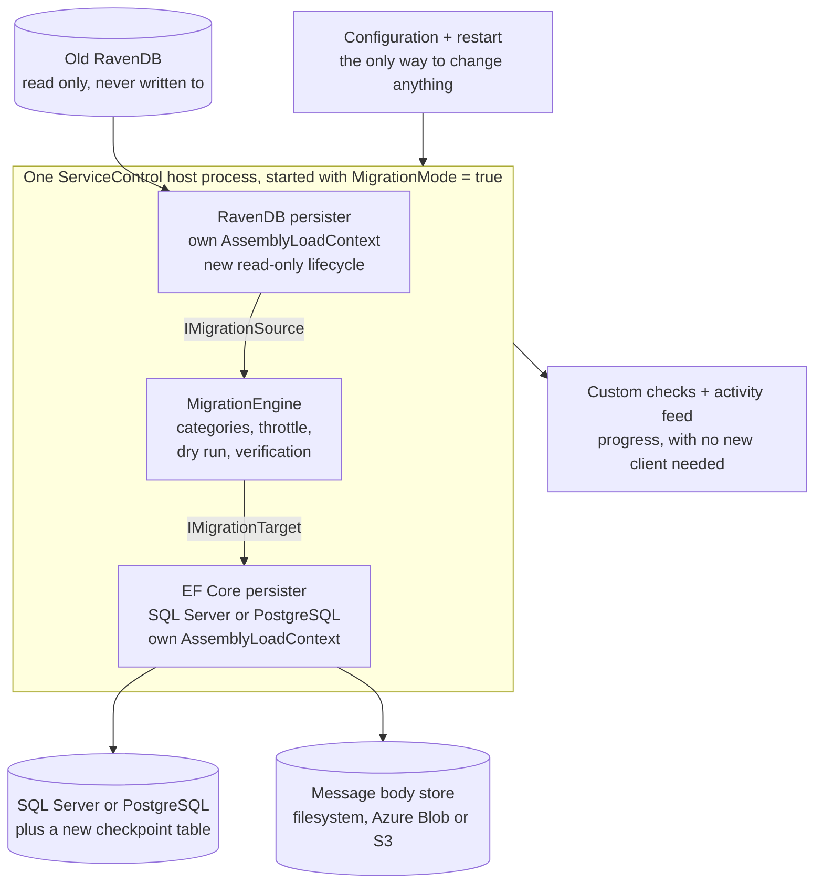
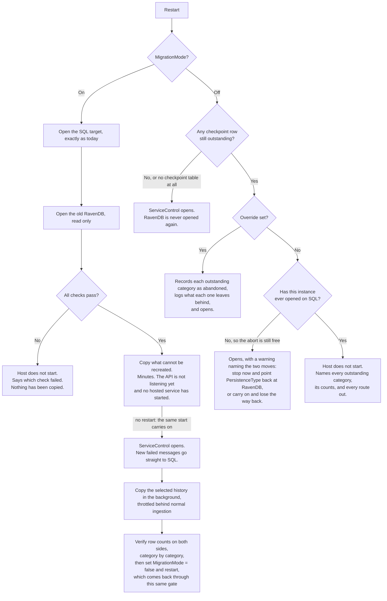
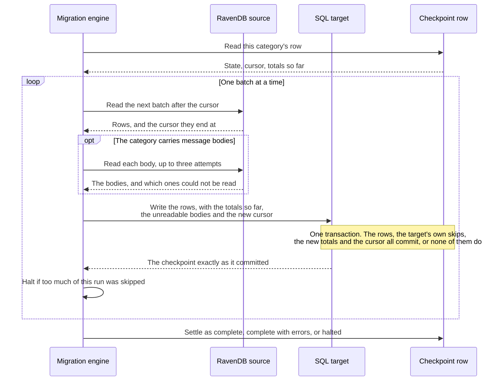
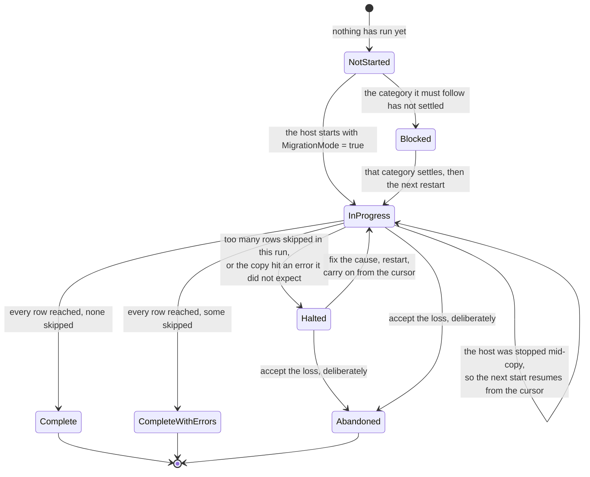

# Moving data from RavenDB to SQL

## Problem

A customer can already point ServiceControl at SQL Server or PostgreSQL. They cannot bring their existing data with them.

This covers the error instance only. The audit instance has no SQL persister, so a customer who finishes this migration still runs RavenDB for audit.

## Strategy

- Switch over first, and copy only what has to be copied. Retention does most of the work: error retention is between 5 and 45 days and event retention is shorter, so most of the source ages out on its own within weeks. That is why archived and resolved messages are optional rather than required. Retention would have deleted them anyway.
- The required set is small because unresolved failures are the only category a customer can act on, and the strategy assumes customers keep that number low by resolving and archiving. **A neglected instance breaks that assumption**: unresolved failures can legitimately be months old, and a large backlog of them makes the closed window long rather than short. The dry run is what tells a customer which case they are in.
- Anything not selected simply ages out of RavenDB, and the customer deletes the old database when they are ready.

## Goals

- **Minimal downtime**. Only the required data copies with ServiceControl closed. Optional data copies in the background while it serves traffic.
- **All three RavenDB sources are supported**. Embedded, a container, or RavenDB Cloud, on one code path rather than three.
- **No writes through the client**. The copier never changes the source, but RavenDB's own expiration does: the primary database already has it configured, and the sweep keeps deleting failed messages and event log items throughout the migration and for as long afterwards as the instance is left running. The old database is a fallback that degrades from the moment you start.
- **Abandonable up to a known point, and only up to that point**. While ServiceControl is closed the copy can be thrown away at no cost, because nothing but the copier has written to SQL and the migration has written nothing to RavenDB: see [the one point you can go back](#the-one-point-you-can-go-back). Once the host opens there is no way back at all.
- **No duplicates and no gaps**. Rows and the resume cursor commit in one transaction, so a crash needs no reconciliation.
- **Every identifier anything depends on is carried across**. The event log and historic retry operations are renumbered, because nothing references their keys.
- **Refuse rather than half-migrate**. Every check runs before the first row moves, and a failure is a host that will not start.
- **No silent loss**. A migration cannot end with a selected category still in progress or halted, only with each one finished or explicitly abandoned. Abandoning is a deliberate choice, and an abandoned category lets the host open. Skipped rows are counted and reported.
- **Bounded impact on a live instance**. Throttled behind normal ingestion and streamed, so memory does not track the size of the database.
- **Known before it starts, visible while it runs**. A dry run reports what will move and how long ServiceControl is closed, and every category transition is reported as it happens.
- **Use existing functionality where possible**. Progress goes through custom checks and the activity feed, so no new client or screen is needed.

## Deliberately not built, and not currently planned

- **Zero downtime.** The required data is copied with ServiceControl closed, so there is a real, if short, outage.
- **Reversible once ServiceControl opens.** Nothing copies SQL rows back to RavenDB, so once the host has served traffic there is no rollback of any kind.
- **Steerable while running.** No pause, resume, or abort. Changing anything means editing configuration and restarting.
- **A general-purpose migration tool.** The source is always RavenDB and the target is always a ServiceControl EF Core persister, both at versions this build can read.
- **Custom migration UI via ServicePulse.** Custom checks and the event log will be used for progress reporting, but migration configuration and migration engine control will not be available via the UI.

## Supported migration scenarios

The copier runs inside the ServiceControl host, so every row and every message body travels from the source, through ServiceControl, to the target. There is no database-to-database transfer, no backup and restore, and no replication. Whether a combination works therefore comes down to whether the ServiceControl host can reach both ends at once, and how long it takes comes down to how far the data has to travel.

**Supported locations:**

- **The RavenDB source**: embedded on the ServiceControl host (Windows installations only, see below), self-hosted on the same network in a container, VM or bare metal, or RavenDB Cloud
- **The SQL target**: SQL Server or PostgreSQL on the ServiceControl host, elsewhere on the same network, in a container, or as a managed cloud service such as Azure SQL, Amazon RDS or Google Cloud SQL
- **Any combination of the two**, subject to the requirements below

**By where the data has to travel:**

- **On-prem to on-prem.** The common case and the fastest. Embedded or self-hosted RavenDB to SQL on the same host or the same network.
- **On-prem to cloud.** RavenDB on the network, managed SQL in a cloud. Works, but each batch is one round trip, so write latency multiplies by the number of batches rather than being amortised away.
- **Cloud to on-prem.** RavenDB Cloud down to local SQL. Works, and the customer pays egress on everything copied, most of which is archived messages and their bodies.
- **Cloud to cloud.** Works, and is only sensible when ServiceControl runs alongside one of them. A host sitting on-prem between two clouds pulls every byte down and pushes it straight back up.
- **The message body store is a third location.** Bodies come out of RavenDB attachments and go wherever the target is configured to put them: a filesystem, Azure Blob or S3, with small text bodies kept inline in the database. That decision is made at the same time as the database move.

**Infrastructure requirements:**

- The ServiceControl host needs network access to the RavenDB source, the SQL target and the body store simultaneously
- Both RavenDB databases, primary and throughput, on one server or cluster
- A SQL Server target must have Full-Text Search installed. `--setup` checks `SERVERPROPERTY('IsFullTextInstalled')` and fails if it is absent, because message search is not optional. A stock SQL Server container image does not include it. PostgreSQL needs nothing extra, since its index is a GIN over `to_tsvector`
- A managed target's transient failures are already survivable: retry on failure is on by default and there is no setting to turn it off

**Not supported:**

- Any server-to-server copy: no backup and restore, no RavenDB ETL or replication into SQL, no external data pipeline
- A host that can reach only one of the two databases at a time, so no staged move by way of an offline copy
- **An embedded RavenDB source when ServiceControl runs in a container.** Reading an embedded database means starting a RavenDB server process, and the container image does not carry one: `ServiceControl.Persistence.RavenDB.csproj:36` excludes the `RavenDBServer` directory from the artifact, and the copy that would restore it at `:44` is conditional on `CI` not being set, which the Dockerfile sets. A containerised instance migrating away from embedded RavenDB has to point at an external RavenDB server rather than at a data directory. Windows installations are unaffected: the installer unzips the server unconditionally
- Primary and throughput RavenDB databases in different locations
- Anything but RavenDB as the source, or anything but a ServiceControl EF Core persister as the target

## Migration workflow

1. Upgrade ServiceControl as normal, still on RavenDB.
2. Set four things in configuration: the new `PersistenceType`, its connection string, `MigrationMode=true`, and which [optional data](#data-to-be-migrated-categories) they want copied.
3. Run `--setup` to create the SQL schema. It fails against a SQL Server instance without Full-Text Search installed.
4. Run the [dry run](#dry-run). It reports what it resolved as a source, what each category holds, and an estimate of how long ServiceControl will be closed. Read [what the dry run reports](#dry-run) before booking an outage around its estimate.
5. Start ServiceControl (`MigrationMode=true`).
6. Every check runs before a single row moves. If one fails the host does not start and names which, having copied nothing, so a wrong database name or unconfigured body storage costs a restart rather than a half-finished migration.
7. The copying of [required data](#required) starts, with ServiceControl still closed: the copy runs inside that same start, before the API begins listening and before any background service runs. This is assumed to be a small amount of data.
8. ServiceControl opens by itself the moment the required copy finishes, with no second restart to perform, and whatever [optional data](#optional) they asked for is copied in the background while the instance runs normally. They can watch it from ServicePulse custom checks and events, but not steer it.
9. They run the verification pass once the background job has completed, which reports row counts on both sides category by category, accounting for deliberate skips so a difference is explained rather than reported as a fault, then set `MigrationMode=false` and restart. It tolerates more rows in SQL than in RavenDB, because RavenDB keeps expiring rows the copier already took.
10. RavenDB data can be removed.

- If `MigrationMode=false` is set while a selected category is still incomplete, the startup is gated: it refuses and names exactly what is outstanding, or, where the [free abort](#the-one-point-you-can-go-back) is still open, starts with a warning that says so. See [turning migration mode off is a gated startup too](#turning-migration-mode-off-is-a-gated-startup-too).
- A category that ended *complete with errors* counts as complete and does not block, though its skipped count is printed so the loss is stated rather than silent.
- An explicit override exists for a customer who has changed their mind and accepts leaving data behind. It marks the outstanding categories as abandoned, which is a deliberate end state rather than a failure, so the progress check settles and the guard stays armed for any later migration.
- **Steps 5 to 7 are the abort window**, which is not the override above: see [the one point you can go back](#the-one-point-you-can-go-back).
- A category that stops because too many rows failed is *halted*, and it stays that way until someone acts: fix the cause and restart to carry on from where it stopped, or abandon it deliberately if you accept the loss. See [a halt stops one category, and clearing it is a restart](#a-halt-stops-one-category-and-clearing-it-is-a-restart).

## Architecture

- **The engine and the host know no store.** They deal in categories, cursors and counts. The source maps a category to what it reads and describes itself as labelled facts, the target maps a category to where it writes and how to count it, and each contributes its own startup checks. RavenDB to SQL is the only pair built, and another pair, such as SQL to RavenDB, would add a source or a target without changing the engine.
- **The source reads the instance's own RavenDB settings**, so an existing customer sets nothing new. Leave them in place when switching `PersistenceType`.
- **Both persisters load into the same process**, each into its own `AssemblyLoadContext`.
- **The engine references neither assembly.** It knows only `IMigrationSource` and `IMigrationTarget`, and treats the resume cursor as an opaque value it passes from one to the other, so it can be tested against fakes on either side.

## Startup sequence

**Checked before a single row moves:**

- The SQL schema is current
- Message body storage is writable
- Both RavenDB databases are reachable
- The client certificate is valid, where the source is an external server
- The source is at a version this build can read
- The selected categories are valid
- `RetryHistoryDepth` is greater than zero. At zero or less, the first completed retry after the migration deletes the entire copied retry history, and no row count would ever show it

### Turning migration mode off is a gated startup too

*The right-hand branch above is the half a customer meets last and expects least, so it is worth reading before the migration starts rather than at the end of one.*

Every startup on a SQL Server or PostgreSQL instance looks at the checkpoint table before ServiceControl opens, whether `MigrationMode` is on or off. That is what stops a migration ending by accident, and it costs nothing on an instance that has never migrated: a RavenDB instance has no checkpoint table at all, a SQL instance whose schema predates this feature says it holds no checkpoint state, and a SQL instance whose categories all finished has nothing outstanding. All three start exactly as they do today.

With `MigrationMode` off and at least one category still outstanding, one of three things happens, and each is said out loud at startup rather than discovered weeks later:

- **The override is set.** Every outstanding category is recorded as abandoned, with its copied and skipped counts left as they are, and the host starts. Each one is logged saying what state it was in, how much it had copied, and that whatever it had not copied stays only in RavenDB. Abandoning is final: selecting that category in a later migration does not copy it again.
- **The override is not set, and this instance has never opened on SQL.** This is the [free abort](#the-one-point-you-can-go-back), so the host starts and warns rather than refusing. The warning names the two moves: stop now and point `PersistenceType` back at RavenDB, which discards the partial copy and costs nothing else, or carry on, which opens ServiceControl on a partly copied database and ends the free abort. It deliberately does not mention the override, because at that moment nothing is lost yet.
- **The override is not set, and this instance has already opened on SQL.** The host does not start. The error names every outstanding category, its state, its copied and skipped counts and its last error, and then the three routes out: restart with `MigrationMode=true` to let the copy finish or to resume a halted category once its cause is fixed, set the override to abandon what is outstanding and start without it, or, if RavenDB is already gone, abandon, because that is the only exit left.

**Which is why the source stays until verification passes.** A customer who decommissions RavenDB while a category is outstanding has both doors shut: `MigrationMode=true` cannot start, because it opens the source before it copies anything, and `MigrationMode=false` refuses. Abandoning is then the only way to start the instance, and it is a real loss whose size is the counts in that message.

## Data to be migrated (Categories)

### Required

- Unresolved **and retry-issued** failed messages, with their bodies. Attempt history collapses to the newest attempt, because the SQL model has no attempts table. Retry-issued messages are required for the same reason unresolved ones are: issuing a retry deletes the expiry, so they never age out. Leaving one behind means the retry confirmation arrives with no row to mark resolved, and the message stays missing from the customer's list while the retry actually succeeded
- Message redirects
- Endpoint settings
- Known endpoints, including the monitored flag. One category, because the flag is a property of the endpoint row and cannot be copied without it
- Notification settings
- The licence trial end date
- Throughput history
- Retry operations, unacknowledged and historic. One category, because RavenDB holds both lists in a single document
- Licensing report masks
- The uploaded licensed endpoint details file, which nothing recomputes: skipping it means the customer re-downloads it from the licence portal and uploads it again
- Subscriptions

### Optional

- Archived and resolved failed messages: the biggest category by far, and most of the copying time
- The event log, without which the ServicePulse activity feed starts empty
- Custom checks, which cost almost nothing to skip because every check re-reports on its next interval
- Failed error imports, the record of errors that could not be ingested
- Group comments, **copied last of everything**, after archived and resolved messages. A comment survives only once the failed messages its group is built from have arrived, so on a large archive the comments are the last thing to appear. An empty comment field partway through a migration is the copy still running, not data loss
- Failed message edits

### Not migrated

- The RavenDB index definitions
- The transient in-flight collections, which are empty when nothing is running: `RetryBatches`, `RetryBatchNowForwardings`, `FailedMessageRetries`, `ArchiveOperations` and `UnarchiveOperations`
- `ArchiveBatches` and `UnarchiveBatches`, which exist only because of how RavenDB works
- `ConnectedApplications`, which only versions 6.0 and 6.1 wrote and nothing has read since
- Integration events still waiting to be sent when you switch over are never sent
- Broker and audit service version details, which refill on the throughput collector's next run

## What does not come across

**Whole categories are never copied.** Which ones, and why nothing needs them, is the [not migrated](#not-migrated) list above. Anything in an optional category you did not select is also never copied, and nothing later goes back for it.

**Rows skipped one at a time, and counted.** Each of these shows up in the skipped count for its category, broken out by reason, so you can see how much went and why:

- A failed message whose `UniqueMessageId` is not a GUID. The target column is a `uniqueidentifier` and the value is never regenerated, because it is simultaneously the primary key, the ServicePulse URL, the retry correlation key and the body lookup key.
- A failed message with no processing attempts recorded against it. The SQL model keeps the newest attempt and derives the failure time, the failing endpoint and the exception from it, all of which are required columns, so a message with nothing to derive them from cannot be written at all rather than being written blank.
- A failed message whose body cannot be read after three attempts. **The whole message is skipped, not just its body**, because a message with no body is worse than no message.
- A subscription whose message type or transport address exceeds 200 characters. The target key columns are capped at 200 characters, so it cannot be stored at all.
- An archived or resolved failed message, or an event log item, already past its retention period. SQL's retention clean-up would delete it on its first pass, so it is counted rather than copied only to be deleted.
- A group comment whose failure group has no failed messages in SQL once the messages are copied. SQL's clean-up removes such a comment, where RavenDB never expired one.
- Endpoint settings for an endpoint ServiceControl does not know. ServiceControl removes those settings shortly after it starts.
- A row missing a value SQL requires, such as a known endpoint with no name or host, or a failed message with no failing endpoint address. An empty group comment is left behind the same way, because ServiceControl never stores one.

**Things that change shape, and are not counted as skips at all.** The dry run counts these before anything moves, so they are a number you see in advance rather than a discovery afterwards. They are also the ones to read twice:

- **Processing attempt history collapses to the newest attempt.** The SQL model has no attempts table. This affects every failed message that failed more than once, in the one category every customer copies. A message that failed five times arrives showing one attempt, and the other four are gone.
- **Subscriptions that differ only in message-type version merge onto one row**, because the target key carries the type name without the version.
- **Endpoint settings for two endpoint names that differ only in case merge onto one row on SQL Server**, because SQL Server's default collation compares names without case, so one of the two settings is kept. PostgreSQL keeps both, and so does a SQL Server database created with a case-sensitive collation. The dry run counts this one too, by asking SQL Server how the name column compares, though for unusual characters its count can differ from what the copy does.
- **Event log items and historic retry operations are renumbered.** Their keys are database identities and nothing references them, so this is safe, but the old numbers do not survive.

**Rows RavenDB deletes while the copy is running are an absence, not a skip.** Expiration only deletes a document carrying `@expires`, and only two kinds ever get one: a resolved or archived failed message, and an event log item (`ExpirationManager.cs:34,41`). Everything in the [required](#required) set is therefore safe, since unresolved and retry-issued messages have their expiry removed when the retry is issued, so only the archived and resolved messages category and the event log category can shrink underneath the copier, and both copy in the background where the window is longest. A document the sweep removes before the stream reaches it is never read, so it is counted nowhere: the counts are of rows the source actually handed over, and there is no expected total to fall short of. It is the same population as the retention skip above, and which of the two it becomes is a race with the sweep. The consequence to know is that the dry run's count is a snapshot rather than a promise, and for those two categories the difference between it and the final copied count is not attributed to anything.

**A category can finish with a small amount of loss and still count as complete.** A few skipped rows in a large table leave the category in a *complete with errors* state, which blocks nothing. Its skipped count is printed and the ids of the skipped rows are written to the log, so while the RavenDB database still exists you can go and look at exactly what did not make it.

## The one point you can go back

While ServiceControl is closed and the required copy is running, nothing except the copier has written to SQL, and the migration has written nothing to RavenDB, which is still authoritative. RavenDB's own expiration still runs, though: unless you disabled it, it keeps deleting expired failed messages and event log items, as [Goals](#goals) describes. If you need your instance back, set `MigrationMode=false`, point `PersistenceType` back at RavenDB, and start. You lose the copy, not your data, and you can start again later.

That window closes the moment ServiceControl opens. From then on new failed messages are ingesting into SQL, RavenDB is no longer current, and there is no rollback: nothing copies SQL rows back. The choice at that point is to finish the migration or to accept losing whatever has not been copied.

## Reading from RavenDB

- A third RavenDB lifecycle opens the source: connect, check the version, stop. It never calls `DatabaseSetup.Execute`.
- Both source databases must be on the same server or cluster (`LicensingDataStore.cs:35`).
- The source has to be at a ServiceControl version this build can read, and nothing in RavenDB records one today. The only version check that exists compares the RavenDB server version to the RavenDB client version, and runs only for an external source. So a marker is stamped into the database on upgrade, and a source without one, or one from a newer major version, is refused by name rather than misread.
- Duration scales with distance to the source. The copier already holds the document from the stream, so each body costs **one** round trip rather than two, but it is one per message and they are not batched. Egress out of RavenDB Cloud is billed to the customer. See [batching and throttling](#batching-and-throttling).

## Writing to SQL

- A whole `FailedMessage` is written with its stored status intact. No existing caller does that, though the dialect upsert already accepts a status, so the gap is smaller than it looks.
- `UniqueMessageId` keeps its value, but converts type: the source holds a string and the target column is a `uniqueidentifier`. It is the primary key, the ServicePulse URL, the retry correlation key and the body lookup key at once.
- `StatusChangedAt` is reconstructed from `@expires` for resolved and archived messages, which is the only place RavenDB sets it. Unresolved and retry-issued messages have no `@expires`, so the copier uses the newest processing attempt's timestamp. The column is `NOT NULL`, so it cannot be left empty, but the value is harmless for those two: the retention sweep only considers resolved and archived rows, so an unresolved message never ages out whatever is written here.
- Message bodies go through `IBodyStoragePersistence`, which owns the compression threshold and the choice of filesystem, Azure Blob or S3. The separate 102,400-byte inline threshold is not there: it lives on the ingestion path, so the copier has to apply it rather than inherit it.
- Throughput rows are written directly rather than through the collector, and the write sets each day's count rather than adding to it. Throughput is a required category, so it copies while ServiceControl is closed, before any collector has written to SQL. Setting is what makes the category safe to resume after a crash, where adding would double-count. Copying the rows is also what stops the audit and broker collectors re-gathering the same days when the host opens, because `LastCollectedDate` is derived from the newest throughput row rather than stored (`LicensingDataStore.cs:45`). The checkpoint is what stops a second pass overwriting days the collectors have written since.
- Identifiers narrow on the way across, and the dry run counts every kind. What narrows, merges or cannot be stored at all is in [what does not come across](#what-does-not-come-across).

## Batching and throttling

- Batch size comes from the provider: SQL Server divides its own parameter budget by the column count, PostgreSQL uses a flat 50 rows.
- The throttle is a configurable pause between batches, defaulting to 100 ms. Lowering it, or turning `MigrationMode` off, is the only remedy for a copy competing with production.

## Checkpointing and resume

A copy that runs for hours will be interrupted at some point: a restart, a dropped connection, a machine reboot. The checkpoint is what makes an interruption cost only the batch that was in flight. It is one row per category, kept on the target and created by `--setup` along with the rest of the schema, and it is written in the same database transaction as the rows it describes. Only the copier writes to it; the status and verify commands read it.

**What one row holds:** the category it tracks, its state, the resume cursor, how many rows were copied, skipped and already present, a count per skip reason, how many rows the source held when the category started, when it started, when it last made progress, when it settled, the last error, and a version number used to spot a second writer.

**The states, and which ones a restart re-enters.** `Complete`, `CompleteWithErrors` and `Abandoned` are terminal, so a restart passes straight over the category. `Halted` and `Blocked` are not: a halt is resumed from its cursor once the cause is fixed, and a block clears itself once the category it waits on settles, which is how group comments end up behind archived messages. `NotStarted` and `InProgress` both mean there is work to do.

### One batch, and why nothing provisional is ever saved

The thing to read twice is that the counts never travel back through the engine to be saved on some later write. The engine hands the target the totals so far, the target adds its own outcome to them and saves the result beside the rows, and the engine then keeps whatever committed. So there is no window in which the stored row claims rows that are not there, and a crash at any instant leaves counts and cursor that both describe exactly the rows in SQL.

**What that buys, and why each part is needed:**

- **Progress never gets ahead of the data.** The rows and the cursor commit together, so a restart cannot skip past rows that were never written.
- **A crash costs the batch in flight and nothing else.** The next run reads from the committed cursor.
- **Re-reading a batch cannot double-count it.** Unreadable bodies stay off the checkpoint until the write commits, so a batch that is read twice is counted once, and rows the earlier attempt did write come back as *already present* rather than as fresh copies.
- **Every skipped row has a reason, or the save is refused.** The checkpoint rejects a batch reporting more skips than it explains, because verification has to account for each one rather than report a healthy migration as broken.
- **Each category resumes independently**, so a half-copied category picks up where it stopped while its neighbours are untouched.
- **The halt counters are per run and deliberately not stored.** If the skips that tripped a halt stayed on the row, a restart with the cause fixed would re-trip it on its first batch.
- **A second writer is caught rather than merged.** Each save carries the version it read, and a save against a row that has moved on is refused, so two hosts pointed at one target cannot quietly interleave their progress.
- **If a message is already in SQL the SQL row wins and the copier skips it**, which is what makes every category safe to run twice.

## Error handling

- Which rows are skipped, and why, is in [what does not come across](#what-does-not-come-across). What follows is the mechanics around those rules.
- A body is read up to three times before the message is skipped whole, and the exhausted attempts count toward the halt threshold.
- Deciding whether a row is past the target's retention cutoff needs two retention periods: the source's reverses `@expires` back into the status-change instant, and the target's current one decides whether that instant is past the cutoff.
- A bad row does not stop the copy. Its category finishes in a separate complete-with-errors state.
- The halt threshold is proportional with an absolute floor, and a category halts only when both are exceeded. Proportional alone halts a three-row category on one bad row; absolute alone halts a five-million-row table on its 101st failure at the default floor of 100. Together, a large category keeps going through losses under the percentage and finishes complete with errors, so ten thousand skipped rows out of five million do not halt it.
- Rows left behind because SQL would remove them anyway (past retention, orphaned group comments, settings for unknown endpoints) are counted and reported, but never halt a category. The target reports them apart from its real failures, so they land in the skipped count and the log without moving the category toward a halt.
- The percentage is measured against what the run has processed so far rather than against the category's total, so a run that starts badly looks worse than it is. The floor is what keeps that harmless, since fewer than 101 skipped rows never consults the percentage at all. More than that, bunched at the start, does halt a category whose overall rate would have been fine, and the cost is one restart: the skipped rows commit with the cursor, so the next run resumes past them with its counters back at zero.
- A source therefore must not read a category in an order that puts the rows most likely to be skipped at the front of it.
- Verification therefore cannot treat any count difference as a fault. It accounts for every skip rule, or it reports every successful migration as broken.

### A halt stops one category, and clearing it is a restart

A halt is the copy refusing to keep going on one category because something is wrong beyond the odd bad row. It is not a crash and not data loss: everything already copied is committed, the cursor points at the row after the last one that committed, and the reason is written on the category. Nothing is retried in the background and nothing waits for a timer. The category sits halted until a person does something about it.

**Two things halt a category.** Either the skipped rows in this run pass both the percentage and the floor, which says the failures are systematic rather than incidental, or the copy hits an error it did not expect, in which case the error type and the cursor it stopped at are recorded. A host being shut down is neither: it leaves the category in progress, to be picked up from the cursor next time. Nor is a second host writing to the same checkpoint, which is refused so that the other host's progress stands.

**A halt stops that category and nothing else.** The remaining categories still run, with one exception: a category that must follow the halted one goes to blocked rather than running early, which is how group comments stay behind the archived messages they belong to. A blocked category is not a failure and needs no separate action, since clearing the halt clears the block on the next restart.

**What it costs depends on which category halted.** A halted optional category means the instance keeps serving traffic and that one slice of history is missing until it is resumed. A halted required category means the host stays closed, so the outage carries on until the halt is cleared or the category is abandoned. That is deliberate: opening the host is the point of no return, and it should not happen with required data left behind by accident.

**Clearing it:**

1. Read the reason on the category, in the custom check or the status command. It names the count that tripped the threshold, or the error, and the cursor either way.
2. Fix the cause. It is usually outside the migration: the body store unreachable, a certificate expired, the source or the target down, or the disk full.
3. Restart the host with `MigrationMode=true`. The category picks up at its cursor, its run counters start again at zero, and the skips already recorded stay on the row so the totals still add up at the end.
4. Repeat only if it halts again. A restart that halts at the same point is telling you the cause is still there, and a restart that gets further has made real progress, because the rows it skipped are committed and will not be read again.

**Or abandon it, on purpose.** Abandoning marks the category as deliberately given up rather than failed, which lets the host open and lets the migration end. It is the right answer when the data is not worth the outage, and the wrong one if it was picked by accident, because nothing goes back for an abandoned category afterwards. What it leaves behind is stated in the counts rather than guessed at.

## Dry run

Runnable before anything starts, and again later against whatever is still outstanding. It never writes to RavenDB.

What it resolves and reports:

- Whether the source is embedded or external, and which server
- Which two RavenDB databases, and the setting each name came from
- What it found in each of them
- Rows per category, and message-body volume per category
- A duration for the window while ServiceControl is closed, as a range

It runs the same startup checks that gate startup, so a missing setting surfaces before a customer books an outage.

It counts, before anything moves, the rows that cannot cross as they stand:

- Documents whose `UniqueMessageId` will not parse as a GUID
- Subscriptions that differ only in message-type version, and so merge onto one row
- Subscriptions whose message type or transport address exceeds the 200-character key limit
- Integration event dispatches still queued, which are not copied and will never be sent

It reports no duration for the optional categories, and nothing about load on the source.

### When you can run the read-only commands

`--migration-source-report`, `--migration-verify` and `--migration-dry-run` all open the RavenDB source. **On an embedded source that means stopping the ServiceControl service first**, because a second RavenDB process cannot attach to a data directory the first one holds. Plan the dry run as part of the outage rather than as something you run the day before while the instance keeps serving traffic. On an external source, a container or RavenDB Cloud, all three run against a live instance with no interruption.

A containerised instance runs all three as a one-off `docker run` of the same image with the command's flag, against an external RavenDB server, as the [instructions](ravendb-to-sql-migration-instructions.md#report-on-the-source) show for the source report. It cannot use an embedded source, because the image does not ship the RavenDB server.

`--migration-status` is the exception and is deliberately so: it reads only the checkpoint table in SQL and never opens the source, so it works on every source shape at any time, including during the background copy. It is the command to use for watching progress.

## Configuration and control

- A customer sets `MigrationMode` and the list of categories next to it. A status command and a custom check report back.
- Categories are read fresh at every startup. Adding one copies it on the next restart, removing one deletes nothing.
- There is no HTTP API, no pause, no resume, no abort, and no way to add a category to a running instance. All of those mean editing configuration and restarting.
- The checkpoint table is a record of what happened, not a control channel.
- Stopping a copy takes a restart, so it cannot be stopped in ten seconds.

## Out of scope

- The audit instance, which has no EF Core persister at all, so a customer who finishes this migration is still running RavenDB for audit. This is stated up front under [Problem](#problem), because it changes whether the migration is worth doing at all
- The monitoring instance, which keeps its data in memory, so there is nothing to move
