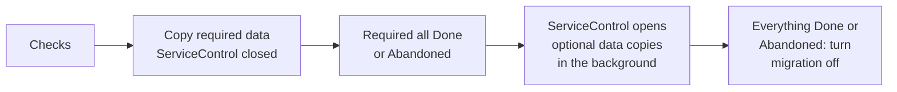
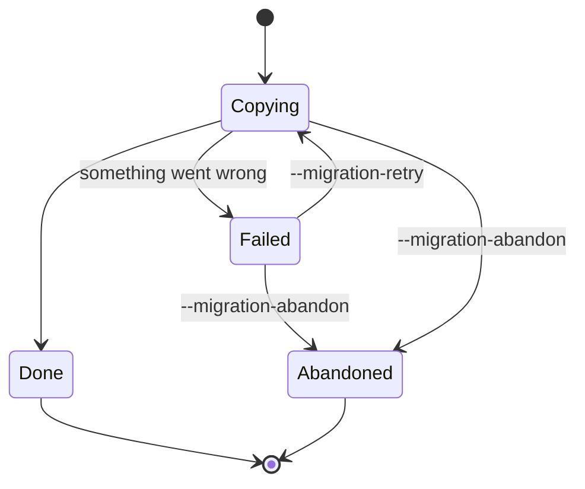
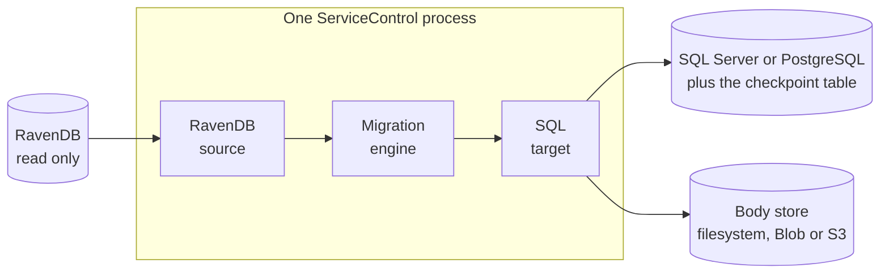
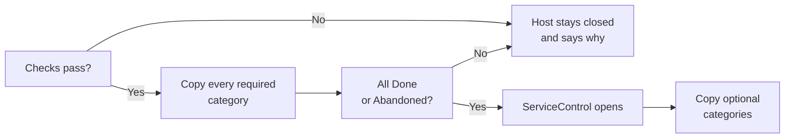
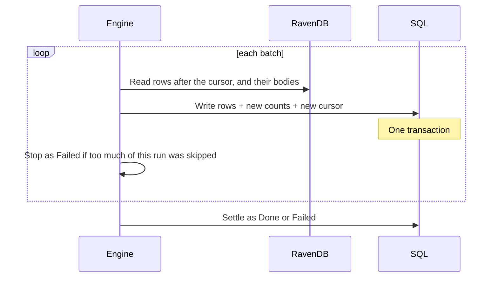

# Migration Engine: Design Overview

> [!NOTE]
> This build does not carry the whole migration yet. This page describes it as it will be when it ships.

This page describes the migration as designed, not what is built today. [The instructions](ravendb-to-sql-migration-instructions.md) describe how an operator runs the migration, and the [system design](ravendb-to-sql-migration-system-design.md) provides the system architecture. See the [glossary](#glossary) for terms used throughout.

## Overview

### What this is

- The migration moves an **error instance's** data from RavenDB to SQL Server or PostgreSQL, so a customer can switch persisters and keep their data.
- It runs inside ServiceControl itself. There is no separate tool.
- **The audit instance is out of scope.** There is no migration path for the audit instance.
- **The monitoring instance is out of scope.** It keeps its data in memory, so there is nothing to move.

### TL;DR

- **Retention does most of the work.** Error retention is 5 to 45 days and event retention defaults to 14 days, so most of RavenDB ages out on its own within weeks.
- **What the instance needs to open is copied while it is closed.** This is the *required* data. Most of it is small.
- **Everything else is copied in the background while it runs.** This is the *optional* data: the event log and archived and resolved messages.
- **Anything not copied ages out of RavenDB**, and the customer deletes the old database when ready.
- **The main thing that makes the outage long is a big backlog of unresolved failures.** They never age out, they are required, and they can legitimately be months old. The strategy assumes you keep them low by resolving and archiving. The *dry run* tells you which case you are in.

```mermaid
flowchart LR
    A["Checks"] --> B["Copy required data<br/>ServiceControl closed"]
    B --> V["Required all Done<br/>or Abandoned"] --> C["ServiceControl opens<br/>optional data copies<br/>in the background"]
    C --> D["Everything Done or<br/>Abandoned: turn<br/>migration off"]
```

### When something goes wrong, you decide what happens next

The end goal is simple: **either all the data comes across, or you explicitly give up on a named part of it.**

- **Each *category* of data is in one of four states:** Copying, Done, Failed or Abandoned.
- **A category goes Failed when something went wrong**, for example a row it could not copy. It stays Failed, and the status says why.
- **You act with one of two commands**, with ServiceControl stopped:
  - `--migration-retry <category>`, after fixing the cause: the next start copies the category again from the beginning.
  - `--migration-abandon <category>`: give up on what it has not copied, and keep what it has.
- **A restart never decides anything for you.** A Failed category stays Failed until you run a command, so a restart policy cannot loop or lose data.
- **ServiceControl opens once every required category is Done or Abandoned**, and the migration is finished once every category is.

```mermaid
stateDiagram-v2
    [*] --> Copying
    Copying --> Done
    Copying --> Failed: something went wrong
    Failed --> Copying: --migration-retry
    Failed --> Abandoned: --migration-abandon
    Copying --> Abandoned: --migration-abandon
    Done --> [*]
    Abandoned --> [*]
```

### Goals

- **Short outage.** Only the required data copies while ServiceControl is closed.
- **Support every RavenDB hosting shape.** Embedded, self-hosted or RavenDB Cloud, on one code path.
- **Never write to RavenDB.** But RavenDB's own expiration keeps deleting old failed messages and event log items, during the migration and afterwards. So the old database is a fallback that degrades from the moment you start, which is why [the instructions](ravendb-to-sql-migration-instructions.md#step-5-back-up-ravendb) have you back it up first.
- **No duplicates and no gaps.** The copied rows and the *checkpoint* commit together, so a crash needs no clean-up.
- **Every identifier anything points at is kept.** Only the event log, historic retry operations and pending integration events get new ids, because nothing points at theirs.
- **Refuses rather than half-migrates.** Every check runs before the first row moves.
- **No silent loss.** Every skipped row is counted with a reason, and a migration cannot finish with a category unfinished unless someone deliberately *abandons* it.
- **Gentle on a live instance.** The copy is streamed, so memory does not grow with the database, and there is a pause between background batches.
- **Known before it starts, visible while it runs.** The dry run predicts the outage, and progress shows up as it happens.

### Non-goals

- **Zero downtime.** There is a real, if short, outage.
- **Rollback once ServiceControl opens.** Nothing copies SQL rows back to RavenDB.
- **Pausing or steering a running copy.** There is no pause, resume or abort. Decisions are two commands run with ServiceControl stopped, and every other change is a configuration edit and a restart.
- **A general-purpose migration tool.** The source is always RavenDB and the target is always one of ServiceControl's SQL persisters, both at versions this build can read. The migration engine was design to be expandable in the future.

### The moving parts

```mermaid
flowchart LR
    subgraph host["One ServiceControl process"]
        src["RavenDB<br/>source"] --> eng["Migration<br/>engine"] --> tgt["SQL<br/>target"]
    end
    old[("RavenDB<br/>read only")] --> src
    tgt --> sql[("SQL Server or PostgreSQL<br/>plus the checkpoint table")]
    tgt --> bod[("Body store<br/>filesystem, Blob or S3")]
```

- **Both persisters load into one ServiceControl process**, each in its own `AssemblyLoadContext`, and both are live during the copy.
- **The engine knows neither database.** It knows only `IMigrationSource` and `IMigrationTarget`, and deals in categories, *cursors* and counts. This allows it to be tested, and expanded in the future.
  - The source maps each category to what it reads, and describes itself as labelled facts.
  - The target maps each category to where it writes and how to count it.
  - Each side adds its own startup checks.
  - The engine passes the cursor from one side to the other without looking inside it.
  - RavenDB to SQL is the only supported pair, but the engine does not depend on it.
- **The source reuses the instance's existing RavenDB settings**, so an existing customer configures nothing new for it. Leave them in place when switching `ServiceControl/PersistenceType`.

### A migration from start to finish

[The instructions](ravendb-to-sql-migration-instructions.md) define the migration steps.

- **The [free abort](#going-back-to-ravendb) window runs from the first start with migration on until ServiceControl opens.** Until then, you can go back to RavenDB and lose only the copy.
- **While required data is still copying, none of ServiceControl's own clean-up runs**: the retention sweep, the purge API, the heartbeat settings sync and throughput collection. The required copy runs before any of them starts, so they start only once it finishes. Optional categories never hold them back.

## Design

### Supported locations

The copy goes from RavenDB, through the ServiceControl host, to SQL. There is no database-to-database transfer. RavenDB holds documents and SQL holds tables, so the rows have to be reshaped, and ServiceControl's own persisters already know how to read one and write the other. So what matters is whether the host can reach both ends, and how far the data travels.

| | Supported locations |
| --- | --- |
| RavenDB source | Embedded on the host (Windows installations only), self-hosted on the network (container, VM or bare metal), or RavenDB Cloud |
| SQL target | SQL Server or PostgreSQL on the host, on the network, in a container, or managed (Azure SQL, Amazon RDS, Google Cloud SQL) |
| Body store | Wherever the target is configured to put bodies: filesystem, Azure Blob or S3. Small text bodies stay in the database. This choice is made at the same time as the database move |

| Route | What to expect |
| --- | --- |
| On-prem to on-prem | The common case, and the fastest: embedded or self-hosted RavenDB to SQL on the same host or network |
| On-prem to cloud | Works. Each batch is a round trip, so write latency adds up per batch |
| Cloud to on-prem | Works. The customer pays egress on everything copied, mostly archived messages and their bodies |
| Cloud to cloud | Works, but only sensible when ServiceControl runs next to one of them. A host on-prem between two clouds pulls every byte down and pushes it straight back up |

**Requirements:**

- The host reaches the RavenDB source, the SQL target and the body store at the same time.
- The SQL database is new and empty: only the schema `--setup` created.
- Both RavenDB databases, primary and throughput, are on one server or cluster. The migration opens both through one `IDocumentStore`, and so does the licensing component.
- A SQL Server target has Full-Text Search installed, because message search needs it.
  - The `AddFullTextSearch` EF Core migration checks `SERVERPROPERTY('IsFullTextInstalled')` and fails if it is absent.
  - An EF Core migration runs once, so this is checked the first time `--setup` brings a database up to that migration, not on every `--setup`.
  - A stock SQL Server container image does not include Full-Text Search.
  - PostgreSQL needs nothing extra, because its search index is a GIN index over `to_tsvector`.
- Transient failures on a managed target are already survivable. Retry on failure is on by default, and no setting turns it off.

**Not supported:**

- Any server-to-server copy: backup and restore, RavenDB ETL or replication, or an external pipeline.
- A host that can reach only one database at a time, so no staged move through an offline copy.
- An embedded RavenDB source when ServiceControl runs in a container. Reading an embedded database means starting a RavenDB server process, and the container image does not include one.
- Primary and throughput RavenDB databases in different places.
- Any source other than RavenDB, or any target other than a ServiceControl SQL persister.

### What data moves

There are eighteen *categories*: sixteen required and two optional.

| Category | Kind | Why |
| --- | --- | --- |
| Unresolved and retry-issued failed messages, with bodies | Required | The point of the instance. Issuing a retry removes the expiry, so retry-issued messages never age out. Leave one behind and the retry confirmation finds no row to resolve, so the message stays missing even though the retry succeeded |
| Message redirects | Required | |
| Known endpoints, with the monitored flag | Required | The flag is part of the endpoint row |
| Endpoint settings | Required | Copied after known endpoints |
| Notification settings | Required | |
| Licence trial end date | Required | |
| Licensing endpoint records | Required | The per-endpoint rows in the throughput database |
| Throughput history | Required | Copied after licensing endpoint records, because each day's row hangs off one |
| Retry operations, unacknowledged and historic | Required | One category, because RavenDB holds both lists in one document |
| Licensing report masks | Required | |
| Uploaded licensed endpoint details file | Required | Nothing recomputes it. Losing it means downloading it again from the licence portal and uploading it again |
| Subscriptions | Required | |
| Integration events still waiting to be sent | Required | Each is an event a subscriber has not received yet. There are only any if the old instance fell behind or could not reach the broker. They are sent once ServiceControl opens, later than they would have been. RavenDB sends them in no particular order anyway, so no ordering is lost |
| Custom checks, with their last status | Required | Not every check reports again. An endpoint that is down never does, and a check with no repeat interval reports only when its endpoint starts. Leaving one out could hide a known failure until that endpoint restarts |
| Failed error imports, with bodies | Required | Messages taken off the error queue but not ingested. They exist nowhere else and never expire. After the move the "Error Message Ingestion" custom check keeps flagging them and `--import-failed-errors` imports them into SQL. Importing them on RavenDB first is better still |
| Group comments | Required | Copied after unresolved failed messages, so a note like "do not retry" is there when ServiceControl opens. Blank comments are not copied. A comment on a group whose messages are all archived or resolved is removed by ServiceControl's usual clean-up soon after it opens, because that group has no failed messages in SQL yet |
| Event log | Optional | The history behind the ServicePulse activity feed. On a busy instance it holds a row for every failure, retry and submission |
| Archived and resolved failed messages, with bodies | Optional | The biggest category by far, and most of the copying time |

**Never copied, because nothing needs them:**

- RavenDB index definitions.
- In-flight work collections, which are empty when nothing is running: `RetryBatches`, `RetryBatchNowForwardings`, `FailedMessageRetries`, `ArchiveOperations` and `UnarchiveOperations`.
- `ArchiveBatches` and `UnarchiveBatches`, which exist only because of how RavenDB works.
- The `ConnectedApplications` document, written only by versions 6.0 and 6.1. Since 6.2 the MassTransit connector status, which ServicePulse uses to turn features on and off, comes from the connector's own heartbeat. ServiceControl holds that in memory and refills it when the connector next reports, so nothing reads the document.
- Broker and audit service version details, which refill on the next throughput collection.
- Failed message edit locks, which stop one failed message being edited twice. An edited message is resolved, so the lock only matters if it fails again: on RavenDB it can then never be edited again, and after the move it can be edited once more.
- Heartbeat state, which neither persister stores and which is rebuilt in memory after any restart. The known endpoints and monitored flags are copied, so heartbeat monitoring after the move behaves exactly as after any restart. An endpoint that is down shows as failing with no last heartbeat time, and raises no alert.

### Optional data windows

- **Each optional category copies only rows inside its *window*:** events raised within it, or messages archived or resolved within it.
- **The window defaults to the instance's own retention period**: `ServiceControl/EventRetentionPeriod` for the event log, `ServiceControl/ErrorRetentionPeriod` for archived and resolved messages. So by default everything RavenDB still holds is copied.
- **`0` turns a category off before it starts.** A longer window than the retention period copies nothing extra, because older rows would only be deleted by SQL's clean-up.
- **The window counts back from when the category first started copying**, which the checkpoint records, so a restart copies the same window rather than one that has slid forward.
- **The window is fixed once the category starts.** A changed value, including a changed retention period behind a default window, is refused at startup, naming the category. To stop a started category short, abandon it.

### Data that changes shape

- **Attempt history collapses to the newest attempt.** SQL has no attempts table, so a message that failed five times arrives showing one attempt. This applies to every failed message, whatever its status.
- **Subscriptions that differ only in message-type version merge into one row**, because the SQL key leaves the version out.
- **On SQL Server, endpoint settings whose names differ only in case merge into one row.** The name column compares without case by default. PostgreSQL keeps both.
  - The name column's own collation decides, not the database default. A case-sensitive database whose name column was given a case-insensitive collation still merges.
  - The copy keeps the first in RavenDB document-id order. That id is a hash of the name, so which one survives is effectively arbitrary.
  - The copy logs a warning naming both endpoints and the one it kept.
  - The dry run lists each pair by asking SQL Server how the column compares. For unusual characters its list can differ from what the copy does.
- **Event log items, historic retry operations and pending integration events get new numbers.** Nothing refers to the old ones, so this is safe.

The dry run counts both kinds of merge before anything moves.

### Skipped rows

Every skipped row is counted under a reason, and its id is written to the log.

> [!IMPORTANT]
> The log is the only record of each skipped row. Look them up in RavenDB while you still have it.

- *Fault* skips mean something went wrong.
- *Harmless* skips are rows SQL would have removed anyway.

| Reason | Kind | Can a retry fix it? |
| --- | --- | --- |
| A message body that cannot be read after three tries, or that RavenDB does not hold at all. The whole message is skipped, because a message with no body is worse than none | Fault | Yes, once the cause is fixed |
| An error from the SQL target | Fault | Yes, once the cause is fixed |
| A `UniqueMessageId` that is not a GUID. It is the key, the ServicePulse URL and the retry key, so it is never regenerated | Fault | No |
| A failed message with no processing attempts, so nothing to fill its required failure time, failing endpoint and exception from | Fault | No |
| A subscription whose message type or address is over 200 characters, the SQL key limit | Fault | No |
| A row missing a value SQL requires, such as a known endpoint with no name | Fault | No |
| Endpoint settings for an endpoint ServiceControl does not know, which it would delete shortly after starting | Harmless | Not needed |
| A blank group comment, which SQL never stores | Harmless | Not needed |
| An archived or resolved message, or event log item, already past its retention period | Harmless | Not needed |

- **Any fault skip makes the category [Failed](#failed-categories)**, even one. Harmless skips leave it Done.
- **Endpoint settings waits until known endpoints is settled**, so an unknown endpoint is always the source's own, never something the migration lost.
- **Rows outside a window are not skips.** They are simply not part of the copy.
- **Rows RavenDB expires during the copy are not skips either.** A deleted row is never read, so it is an absence, not a loss.
  - Expiration only deletes a document carrying `@expires`, and only two kinds ever get one: archived or resolved failed messages, and event log items (`ExpirationManager.cs`).
  - A failed message loses its expiry whenever it becomes unresolved or retry-issued again: when it fails again, is unarchived, or is retried.
  - The exception: a message that failed again after being archived or resolved on version 6.18 or earlier kept its old expiry, and upgrading does not remove it. So a few unresolved messages can still expire during the copy.
  - Both shrinking categories copy in the background, so the copy has hours to race the sweep. A window shorter than the retention period keeps the copy clear of it, by the difference between the two.

### Startup checks

In this order, cheapest first:

1. Source and target are the supported pair, RavenDB to SQL. Answered from settings alone. A RavenDB instance with migration on is refused here, because RavenDB is only ever the source.
2. The optional category windows are valid time spans of zero or more.
3. `ServiceControl/RetryHistoryDepth` is above zero. At zero or less, the first completed retry after the migration deletes the whole copied retry history, and no row count would ever show it.
4. The SQL schema is current. This also refuses a database upgraded without `--setup`.
5. Until a required category has started copying: the SQL database holds no ServiceControl data. `--setup` writes none, but even one plain start of ServiceControl writes rows. Copying into a database that already served on SQL would mix the two.
6. Message body storage is writable. The probe body it writes is deleted again.
7. The SQL target opens, and no optional category's window has changed since that category started.
8. The RavenDB source opens:
   - an embedded server starts;
   - on an external server, the client certificate is in date and an `https://` address has one, checked before the first request;
   - an external server is at least the RavenDB client's version;
   - both databases load, within 5 minutes each on an embedded source.

   If every required category is already Done or Abandoned, a source that will not open does not stop the start. ServiceControl opens, and the optional categories wait for the source.

Checks stop at the first one that refuses, and the refusal names it. Once open, the source can add checks of its own. The RavenDB source adds none.

```mermaid
flowchart LR
    A["Checks pass?"] -->|No| X["Host stays closed<br/>and says why"]
    A -->|Yes| B["Copy every required<br/>category"]
    B --> C["All Done<br/>or Abandoned?"]
    C -->|No| X
    C -->|Yes| D["ServiceControl opens"]
    D --> E["Copy optional<br/>categories"]
```

- **The host also stays closed** if a second instance is writing the same checkpoints.
- **When ServiceControl opens**, the target is marked as opened, which ends the [free abort](#going-back-to-ravendb).
- **Once it has opened, a RavenDB outage does not stop it.** Only the background copy needs the source then, so ServiceControl opens anyway, and the optional categories [wait for the source](#failed-categories) to come back.

### Reading from RavenDB

- **The source opens RavenDB read-only**: connect, check the version, stop. It never runs RavenDB's database setup, and it refuses any write request.
- **Both source databases are opened through one `IDocumentStore`**, which is why they must be on the same server or cluster.
- **Upgrade on RavenDB first**, so the build doing the copy is the one that last ran against the source. Nothing checks this. A RavenDB start rewrites no stored document, so the copy reads exactly what this build's RavenDB persister would read. The only version check compares the RavenDB server to the RavenDB client, and only for an external source.
- **Distance to the source sets the pace.** The copier already holds each document from the stream, so each body costs one round trip rather than two. But it is one per message, and they are not batched. Egress out of RavenDB Cloud is billed to the customer.

### Writing to SQL

- **A failed message is written whole**, with its status unchanged.
- **`UniqueMessageId` keeps its value** but changes type, from a string in RavenDB to a `uniqueidentifier` column in SQL. It is the primary key, the ServicePulse URL, the retry correlation key and the body lookup key at once.
- **`StatusChangedAt` is rebuilt.**
  - For archived and resolved messages it comes from `@expires`, the only place RavenDB records it.
  - For unresolved and retry-issued messages it is the newest attempt's time, because the column is `NOT NULL` and cannot be left empty. That is harmless, because the retention sweep only considers archived and resolved rows.
- **Deciding whether a row is past retention needs two retention periods.** The source's turns `@expires` back into the status-change time. The target's current one decides whether that time is past the cutoff.
- **Bodies go through `IBodyStoragePersistence`**, which owns compression and the choice of filesystem, Azure Blob or S3. The copier applies the inline threshold itself, because that threshold lives on the ingestion path. It defaults to 102,400 bytes and is set by `ServiceControl/MaxBodySizeToStore`.
- **Throughput rows are written directly, not through the collector, and each day's count is set, not added.**
  - Throughput is required, so it copies while ServiceControl is closed, before any collector has written to SQL.
  - Setting makes the category safe to resume after a crash, where adding would double-count. The collector's own path does add (`LicensingDataStore.cs:198`).
  - Copying the rows stops the audit and broker collectors gathering the same days again, because `LastCollectedDate` is worked out from the newest throughput row (`LicensingDataStore.cs:45`).
  - The checkpoint stops a second pass overwriting days the collectors have written since.

### Batch size and throttling

- **Batch size comes from the database.** SQL Server divides its parameter budget by the column count, PostgreSQL uses a flat 50 rows.
- **Background batches have a pause between them**, 100 ms by default, set by `ServiceControl/Migration/ThrottlePauseMilliseconds`. The first batch of each category is not paused.
- **Raise the pause if the copy competes with production.** Turning migration off is not a remedy: the host refuses to start until every category is Done or Abandoned.
- **The required copy is never paused**, because ServiceControl is closed and nothing competes with it.

### Progress and checkpoints

The checkpoint is one row per category, kept in the SQL database and created by `--setup`. It holds the category's *state*, its cursor, its copied, skipped and already-present counts, the count per skip reason, timings, the last error, the window it copies with, and a version number to catch a second writer.

```mermaid
sequenceDiagram
    participant E as Engine
    participant S as RavenDB
    participant T as SQL
    loop each batch
        E->>S: Read rows after the cursor, and their bodies
        E->>T: Write rows + new counts + new cursor
        Note over T: One transaction
        E->>E: Stop as Failed if too much of this run was skipped
    end
    E->>T: Settle as Done or Failed
```

- **Progress never gets ahead of the data.** Rows and cursor commit together, so a restart never skips rows that were not written.
- **A crash costs only the batch in flight.** The next start carries on from the committed cursor.
- **A batch read twice is counted once.** Rows already in SQL come back as *already present*, never as copies or skips, so every category is safe to run twice. Unreadable bodies stay off the checkpoint until the write commits.
- **Every skip has a reason, or the save is refused.** The per-reason counts must add up exactly to the skipped count, and the target's counts must match what it committed.
- **The stored counts always describe the rows in SQL.** The target adds its own outcome and saves the result beside the rows, so nothing is saved later or separately.
- **A second writer is caught, not merged.** Each save carries the version it read, so two hosts, or a command and a host, pointed at one database cannot interleave.
- **A copy stopped between two categories still shows the ones it never reached.** Before copying anything, a start saves a *not started* row for each category it is about to copy, so every gate sees them as unfinished.
- **Only the copier and the two commands write the checkpoint.** The status and verify commands only read it.

### Failed categories

A category is *Failed* when something went wrong. Everything already copied stays committed. Nothing is retried in the background and nothing waits for a timer: the category stays Failed, with the reason written on it, until you run a [command](#retry-and-abandon).

**What makes a category Failed:**

- **Any fault skip by the end of the category**, even one.
- **Too many fault skips in this run, which stops it early.** More than 5% of the rows processed so far *and* more than 100 rows (`ServiceControl/Migration/HaltThresholdPercent`, `ServiceControl/Migration/HaltThresholdMinimum`). Needing both means a tiny category does not stop on one bad row, and a huge one does not stop on its 101st. Under the threshold a category runs to the end, so you get the whole list of bad rows in one pass.
- **The category's own counts not balancing:** every row read must be copied, skipped or already present.
- **In a required category only, an exception or a stall of 30 minutes with nothing committed**, such as the body store unreachable, a certificate expired, the source or target down, or the disk full. The error and the cursor are recorded.

**What does not make it Failed:**

- **Harmless skips.**
- **A shutdown or a crash.** The category stays Copying and the next start carries on from the cursor.
- **An exception or a stall in an optional category.** The error is written on the category, shown in status, and the next start carries on from the cursor. A RavenDB outage after opening is handled the same way. So a network blip never forces anything to be abandoned. If the error keeps coming back, retry or abandon the category.

**What a Failed category costs:**

- **The other categories still run.** Every required category gets its go in one start, so one fix-and-retry covers them all. A category that must follow a Failed one waits.
- **A Failed required category** keeps ServiceControl closed until it is retried to Done or abandoned. That is deliberate: opening the host is the point of no return.
- **A Failed optional category** leaves the instance running with that slice missing, and stops the migration being finished.

**What the checks cannot see, and accept:**

- **Nothing compares SQL with the source automatically.** Too much moves the numbers on a healthy copy: RavenDB expiry, merges, and SQL's own clean-up once open. `--migration-verify` prints both sides for a person to read.
- **So a read that ends early, or a write that silently stores fewer rows, still ends Done.** Already present is what is left over after copied and skipped, so the counts balance. The counts check does catch rows dropped while a batch is prepared.
- **The threshold judges this run only.** A bad start can stop a category whose overall rate would have been fine, and the source must not read the rows most likely to be skipped first.

### Retry and abandon

Stop ServiceControl, run one of these, then start it again. In a container, run the command as a one-off `docker run --rm <image> <command>` against the same database, the same way as `--migration-source-report`.

| Command | Works on | What it does |
| --- | --- | --- |
| `--migration-retry <category>` | A Failed category, or an optional one still copying with an error | The next start copies it again from the beginning |
| `--migration-abandon <category>` | A Failed or started required category, or any optional one | Gives up on what it has not copied, and on any category whose rows hang off it. What they copied stays in SQL. Final |

**To retry:**

1. Read the reason in the refusal, the log or `--migration-status`. It names the skipped rows by reason, or the error.
2. Fix the cause. It is usually outside the migration: the body store unreachable, a certificate expired, the source or target down, or the disk full.
3. Run `--migration-retry <category>`, then start ServiceControl.

**What a retry does:**

- **It re-reads the whole category from the start**, every time, which recovers from anything. Rows already in SQL are left alone, so only the rows that failed can change. Every message body is read again, so a retry takes about as long as the first copy.
- **Historic retry operations and pending integration events** get new keys from SQL on every insert, so a re-read could not recognise rows already copied. A retry of either first deletes what that category copied, in the same save as the reset. That is safe because both are required, so ServiceControl has not opened and the target started empty.
- **The event log cannot be retried.** It also gets new keys, but it copies after ServiceControl opens, when copied rows cannot be told apart from live ones. It can only be abandoned.

**To abandon:**

- **A required category can be abandoned once it is Failed or has started copying.** One that never ran cannot, so nothing required is given up blind. If RavenDB is gone before it starts, point back or start over: ServiceControl has not opened, so nothing being served is lost.
- **An optional category can be abandoned at any time.** That is how to stop a big optional copy short, or get out when RavenDB is gone.
- **Abandoning cascades to categories whose rows hang off it**, and the command names each: throughput history (it points at licensing endpoint records) and endpoint settings (it belongs to known endpoints). Group comments only waits for unresolved failed messages, so it is not abandoned with them.
- **Some skips no retry can fix**: a non-GUID id, a failed message with no processing attempts, a key over 200 characters, a missing required value. The refusal and the dry run say which, so abandon after the first failure rather than retrying.

> [!IMPORTANT]
> Abandon is final. Nothing goes back for an abandoned category, so it is right when the data is not worth the outage, and wrong if picked by accident.

**Nothing happens on a restart that you did not ask for.** A container or service restart policy restarts a refused host without anyone looking, and gets the same refusal each time, without reading anything. That is loud and loses nothing.

### Ingestion workers

- **An `--error-ingestion-only` worker never runs the copy.** On RavenDB it is refused, as before, because only SQL can scale out.
- **On SQL it starts only when every required category is Done or Abandoned**, whether or not its own migration setting is on. Otherwise it refuses and names each required category still outstanding. Optional categories still copying do not hold it back.
- **That check runs even on a worker someone forgot to flag**, because ingesting into a part-copied database would make going back a loss.
- **`--import-failed-errors` on SQL runs the same check**, because it writes failed messages too.
- **A worker or import that gets past the check marks the target as opened**, whether or not its own migration setting is on. Once it has written, going back to RavenDB would lose that data, so it ends the free abort just as the main host opening does.

> [!IMPORTANT]
> **Start workers only after the main host has opened.** One started at the same moment as the first migration start can slip in before the copy has written its first checkpoint, and nothing stops it.

### Going back to RavenDB

**While ServiceControl is closed**, only the copier has written to SQL and the migration has written nothing to RavenDB, which is still the source of truth. This is the *free abort*. RavenDB's own expiration still runs, though, unless you disabled it.

- **To go back:** set `ServiceControl/Migration/Enabled=false`, point `ServiceControl/PersistenceType` back at RavenDB, and start. You lose the copy, not your data.
- **To try again later:** start from a new, empty SQL database (`--setup`).

> [!IMPORTANT]
> Never reuse the old copy. It would skip every category already finished and miss anything RavenDB received since, and nothing can detect the reuse, because it looks exactly like a normal resume.
>
> **Once ServiceControl opens**, new failed messages go to SQL and there is no way back. You can only finish the migration, or abandon what is left.

**Turning migration off before every category is Done or Abandoned is refused**, not a quiet exit. That is what stops a migration ending by accident.

- **Every SQL start checks the checkpoint table, with migration on or off.** It costs nothing when nothing is outstanding, and a RavenDB instance never reaches it.
- **With nothing outstanding, nothing changes.** A SQL instance starts exactly as before, without opening RavenDB.
- **An optional category that never started and whose window is `0` is not outstanding.** It was turned off before it began.
- **With anything outstanding, the host refuses.** It names each category with its state, counts and last error, and the ways out:
  - turn migration back on to finish, after `--migration-retry` for any Failed category;
  - `--migration-abandon` what you are giving up on;
  - point back at RavenDB, which is free only if ServiceControl never opened on SQL (the refusal says which);
  - start over against a new, empty SQL database.

**Keep RavenDB until every category is Done or Abandoned.** Before ServiceControl has opened, nothing can start without it. After, ServiceControl still opens, and the optional categories wait for RavenDB to come back, or can be abandoned.

### The dry run

The dry run never writes to RavenDB, and can run again later against whatever is outstanding. It reports:

- Whether the source is embedded or external, and which server.
- Both RavenDB database names, and the setting each came from.
- Rows and body volume per category, counting only what is inside each window.
- **A range for how long ServiceControl will be closed. The range is a floor, not a promise:** it times counting the rows and sizing the bodies, not reading every row and body or writing to SQL, so the required copy can take longer.
- **A duration for each optional category**, timed from a sample of its rows and bodies plus the pause between batches. ServiceControl is open while these copy.
- The result of the same startup checks a real start runs, so a missing setting surfaces before anyone books an outage.
- How many failed error imports there are, with advice to run `--import-failed-errors` on RavenDB first. They are copied either way, but ones imported first arrive as ordinary failed messages.
- Rows that would be skipped or merged, by reason, and which of those no retry can fix. If a required category holds any, it will end Failed, so plan to abandon it after its first failure.

It says nothing about load on the source.

**When each read-only command can run:**

| Command | What it does | Opens RavenDB? |
| --- | --- | --- |
| `--migration-source-report` | Source facts and a document count per collection | Yes |
| `--migration-dry-run` | The report above | Yes |
| `--migration-verify` | Row counts on both sides, with skips and merges explained. A windowed category is counted inside its window on both sides. Exits 0 only when every category is Done or Abandoned, so a script can ask whether the migration is finished. Counts that differ on a Done category are shown, not failed | Yes |
| `--migration-status` | Each category's state, progress, last error and the commands it can take | No, so it runs any time |

- **On an embedded source, stop the ServiceControl service before any command that opens RavenDB.** A second RavenDB process cannot use a data directory the first one holds, so the dry run is part of the outage.
- **On an external source** they all run against a live instance.
- **In a container**, run each as a one-off `docker run` of the same image against an external RavenDB server.
- **Row counts on the two sides can differ without anything being wrong.** SQL can hold more, because RavenDB keeps expiring rows the copier already took. SQL can hold fewer, because once open, ServiceControl sends pending integration events, removes comments on empty groups and removes failed error imports once imported.

### Monitoring and settings

| Setting | Default | What it does |
| --- | --- | --- |
| `ServiceControl/Migration/Enabled` | `false` | Turns the migration on |
| `ServiceControl/Migration/EventLogWindow` | `ServiceControl/EventRetentionPeriod` | How far back the event log copy goes. `0` turns it off |
| `ServiceControl/Migration/ArchivedAndResolvedFailedMessagesWindow` | `ServiceControl/ErrorRetentionPeriod` | How far back the archived and resolved copy goes. `0` turns it off |
| `ServiceControl/Migration/ThrottlePauseMilliseconds` | `100` | Pause between background batches |
| `ServiceControl/Migration/HaltThresholdPercent` | `5` | Percentage part of the early-stop threshold |
| `ServiceControl/Migration/HaltThresholdMinimum` | `100` | Floor part of the early-stop threshold |

- **The source needs no new settings.** It reads the instance's existing RavenDB settings.
- **Settings are read fresh at every start**, except that an optional category's window is fixed once that category starts.
- **Progress shows in the ServicePulse activity feed, the log and `--migration-status`.** The activity feed records when the background copy starts and finishes, when a category fails, and when the source cannot be reached. A start with migration still on after every category is Done or Abandoned logs a warning to turn it off. There is no migration custom check, because custom checks are being removed from ServiceControl.
- **Decisions are two commands, run with ServiceControl stopped:** `--migration-retry` and `--migration-abandon`. There is no HTTP API, pause, resume or abort, and no way to add a category to a running instance.
- **Stopping a copy takes a restart.**

## Glossary

- **Category:** one kind of data copied as a unit, such as known endpoints or the event log.
- **Required category:** one ServiceControl needs the moment it opens, so it copies while ServiceControl is closed.
- **Optional category:** one copied in the background after ServiceControl opens. It can be shortened or turned off before it starts.
- **Window:** how far back an optional category copies.
- **Closed period:** the time ServiceControl is not serving traffic because the required copy is running.
- **Checkpoint:** the row in SQL recording one category's progress, saved in the same transaction as the rows it describes.
- **Cursor:** the position in RavenDB the copy has reached in a category.
- **State:** one of Copying, Done, Failed or Abandoned.
- **Copying:** not finished yet, including waiting to start, or stopped on an error that the next start will try again.
- **Done:** every row is in SQL, or was left out for a harmless reason, and the counts balance.
- **Failed:** something went wrong. Stays Failed until you run `--migration-retry` or `--migration-abandon`.
- **Abandoned:** you gave up on what a category had not copied, or on one it depends on. Final.
- **Already present:** a row the copier found in SQL already, so it left it alone.
- **Fault skip:** a row lost because something went wrong.
- **Harmless skip:** a row left behind because SQL would have removed it anyway.
- **Free abort:** going back to RavenDB at no cost, possible only while ServiceControl is still closed.
- **Dry run:** a read-only rehearsal that reports what would move, what would be skipped and how long the outage would be.

## Further reading

- [The instructions](ravendb-to-sql-migration-instructions.md): how an operator runs the migration.
- [How the migration is put together](ravendb-to-sql-migration-system-design.md): which class does what, and what is built so far.
