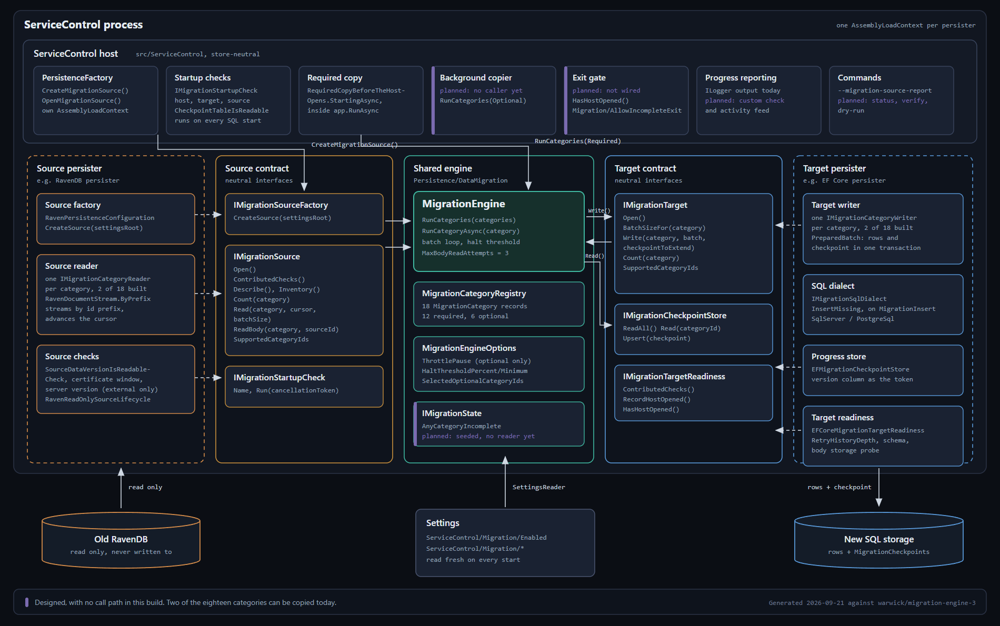
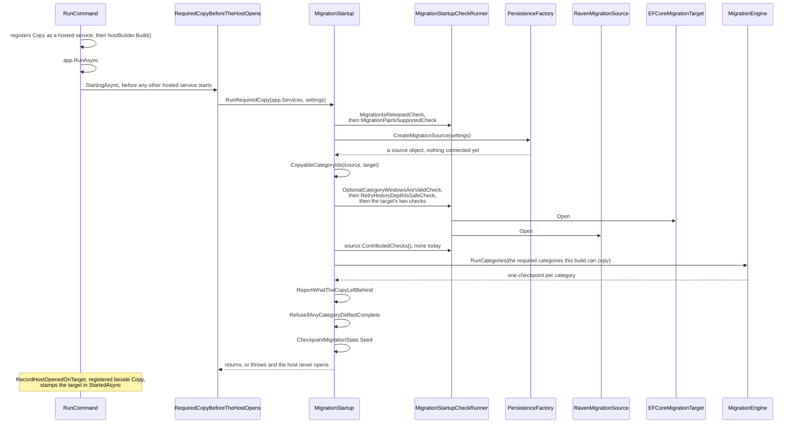

# How the migration is put together

*Written for someone about to change the migration code, not for someone running a migration. [The overview](ravendb-to-sql-migration-overview.md) says what the migration does and what a customer sees. This page says which class does it, who calls it, and why it sits where it does, so anyone moving one piece can see what else moves with it. Read it before you reorder the startup checks or add a category, because in both of those the order is the design. The operator steps are in [the instructions](ravendb-to-sql-migration-instructions.md).*

Setting keys on this page are written as the code writes them, relative to the `ServiceControl` settings root. An operator sets `ServiceControl/Migration/Enabled`, which the code calls `Migration/Enabled`.

## Everything at once, before the detail

## Four assemblies, and what each one is allowed to know

| Assembly | What it holds | Why there |
| --- | --- | --- |
| `ServiceControl.Persistence` | `MigrationEngine` and the contracts it drives: `IMigrationSource`, `IMigrationTarget`, `IMigrationCheckpointStore`, `IMigrationStartupCheck`, `IMigrationTargetReadiness`, `IMigrationState`, `IMigrationSourceFactory`, plus `MigrationCategoryIds`, `MigrationCategoryRegistry`, `MigrationCheckpoint`, `MigrationBatch`, `MigrationWriteResult`, `MigrationSourceDescription`, `MigrationSkipReason`, `MigrationCategoryStateExtensions`, `CheckpointMigrationState`, `MigrationCheckpointConflictException`, `MigrationEngineOptions`, `MigrationSettings` and `HaltThreshold` | Both persisters and the host reference it, and it references neither persister. That is what lets the engine be driven entirely by fakes in `ServiceControl.UnitTests/Migration` |
| `ServiceControl.Persistence.RavenDB` | `RavenMigrationSource`, `RavenReadOnlySourceLifecycle`, `RavenDocumentStream`, one `IMigrationCategoryReader` per category | Everything that knows a document id prefix, a RavenDB session or an embedded server lives on the source side |
| `ServiceControl.Persistence.EFCore` | `EFCoreMigrationTarget`, `EFCoreMigrationTargetReadiness`, one `IMigrationCategoryWriter` per category, `IMigrationSqlDialect`, `MigrationInsert`, `PreparedBatch`, `EFMigrationCheckpointStore`, `MigrationCheckpointExtensions` and the target's two checks | Everything that knows a table, a column width or a provider's parameter ceiling lives on the target side |
| `ServiceControl` (the host) | `RequiredCopyBeforeTheHostOpens`, `RecordHostOpenedOnTarget`, `MigrationStartup` with its nested `ClosedWindowProgress`, `MigrationStartupCheckRunner`, `MigrationPairIsSupportedCheck`, `MigrationIsReleasedCheck`, `AllowUnreleasedMigration`, `OptionalCategoryWindowsAreValidCheck`, `RetryHistoryDepthIsSafeCheck`, `FinishedCopyBeforeAnIngestionNodeOpens`, `MigrationSourceReportCommand`, `PersistenceFactory.CreateMigrationSource` | The only place that names both persisters at once, because deciding whether this pair is supported is the one question neither side can answer alone |

Two provider assemblies sit below the EF Core one and hold the only provider-specific migration code: `SqlServerMigrationSqlDialect` and `PostgreSqlMigrationSqlDialect`, each implementing `IMigrationSqlDialect`. They are where a parameter ceiling and a column collation are known.

## The wiring is in place on every SQL instance, migrating or not

Two registrations happen while the host is being built, long before anything decides whether a migration is running, because resolving them is how the copy finds them later:

- **`BasePersistence.RegisterDataStores`**, reached through each provider's `AddPersistence`, registers `IMigrationCheckpointStore` as `EFMigrationCheckpointStore`, `IMigrationTargetReadiness` as `EFCoreMigrationTargetReadiness` and `IMigrationTarget` as `EFCoreMigrationTarget`. All three are singletons. On an instance that does not migrate, only an `--error-ingestion-only` worker constructs any of them, for its start gate below. The RavenDB persister registers none of the three, which is exactly what makes RavenDB a source and never a target.
- **`HostApplicationBuilderExtensions.AddServiceControl`** registers `IMigrationState` as a `CheckpointMigrationState` wrapping whatever `IMigrationCheckpointStore` the persister registered, or none at all on RavenDB. It is a `TryAddSingleton`, so a test can put its own in first.

**`FinishedCopyBeforeAnIngestionNodeOpens` keeps an `--error-ingestion-only` worker out of a database a copy has not finished filling.** `ErrorIngestionOnlyCommand.BuildHost` registers it on every ingestion-only host, and `ImportFailedErrorsCommand.BuildHost` on every SQL import, whether or not `Migration/Enabled` is on, which is an agreed exception to the rule that a non-migrating instance runs no migration code: a worker someone forgot to flag would otherwise ingest into a part-copied database, which turns abandoning the copy from a clean rollback into a loss. In `StartingAsync` it reads every checkpoint row, and only when a category is unfinished does it read `Migration/AllowIncompleteExit`. It sees a category the copy never reached because `MigrationEngine.RunCategories` saves a `NotStarted` row for every category it was given before it copies the first one; without that, a copy stopped between two categories would leave only finished rows and the worker would start. Without `Migration/AllowIncompleteExit` it refuses and names it. With it, the worker starts, logs a warning naming what is unfinished, and in `StartedAsync` calls `IMigrationTargetReadiness.RecordHostOpened`, flag on or off, because ingesting into a part-copied database is exactly what ends the free abort. The worker never runs the copy itself: one host does, and a second copier would race it.

## Starting the host with the migration on runs the required copy inside host start

*The sequence below is what the code does when the copy can run. On a real build it stops at `MigrationIsReleasedCheck`, which refuses every copy until the whole migration has shipped. Only two of the eighteen categories have both a reader and a writer, so even past it the copy would move only those two. Read the whole section before you assume any step after that one has ever executed outside a test.*

```mermaid
sequenceDiagram
    participant Run as RunCommand
    participant Copy as RequiredCopyBeforeTheHostOpens
    participant Start as MigrationStartup
    participant Checks as MigrationStartupCheckRunner
    participant Factory as PersistenceFactory
    participant Source as RavenMigrationSource
    participant Target as EFCoreMigrationTarget
    participant Engine as MigrationEngine

    Run->>Run: registers Copy as a hosted service, then hostBuilder.Build()
    Run->>Run: app.RunAsync
    Run->>Copy: StartingAsync, before any other hosted service starts
    Copy->>Start: RunRequiredCopy(app.Services, settings)
    Start->>Checks: MigrationIsReleasedCheck,<br/>then MigrationPairIsSupportedCheck
    Start->>Factory: CreateMigrationSource(settings)
    Factory-->>Start: a source object, nothing connected yet
    Start->>Start: CopyableCategoryIds(source, target)
    Start->>Checks: OptionalCategoryWindowsAreValidCheck,<br/>then RetryHistoryDepthIsSafeCheck,<br/>then the target's two checks
    Checks->>Target: Open
    Checks->>Source: Open
    Start->>Checks: source.ContributedChecks(), none today
    Start->>Engine: RunCategories(the required categories this build can copy)
    Engine-->>Start: one checkpoint per category
    Start->>Start: ReportWhatTheCopyLeftBehind
    Start->>Start: RefuseIfAnyCategoryDidNotComplete
    Start->>Start: CheckpointMigrationState.Seed
    Start-->>Copy: returns, or throws and the host never opens
    Note over Run: RecordHostOpenedOnTarget, registered beside Copy,<br/>stamps the target in StartedAsync
```

The order is not incidental, so each position is worth the sentence:

- **`RequiredCopyBeforeTheHostOpens` is why the copy runs inside host start rather than before it.** `RunCommand` registers it only when `Migration/Enabled` is true, before `hostBuilder.Build()`, and `app.RunAsync` then drives its `StartingAsync`. A Windows service that has reported nothing for 30 seconds is killed by the Service Control Manager, and a copy that ran before `RunAsync` would be exactly that silence.
- **`MigrationPairIsSupportedCheck` runs second**, because it is the only remaining check answerable from settings without touching a database. The source is always `PersistenceFactory.MigrationSourcePersistenceType`, so it resolves only `PersistenceType` through `PersistenceManifestLibrary` and compares it against `PersistenceFactory.SqlPersistenceNames`. An unsupported pair costs a message rather than a connection attempt.
- **`MigrationIsReleasedCheck` refuses every copy until the whole migration has shipped.** It runs first, because it needs nothing and no other check's answer matters on a build that refuses anyway. It refuses unless the test-only DI marker `AllowUnreleasedMigration` is registered. The required categories become copyable long before the background copy, the end-of-migration guard and verification exist, so nothing short of this check stops a real copy in between. While it exists, `RunRequiredCopy` copies only the required categories both sides support and logs the rest, which is safe only because this check refuses every real start. The last phase of the migration deletes it, stops that skipping, and adds a build-time test that every required category has a reader and a writer. The acceptance fixture's `AllowingAnUnreleasedMigration` registers the marker, so every host test gets past it.
- **`PersistenceFactory.CreateMigrationSource` builds the source without opening it.** It resolves the source persistence by name and casts its configuration to `IMigrationSourceFactory`, which only `RavenPersistenceConfiguration` implements. It is a hard cast, so a persister that does not implement it fails with an `InvalidCastException`. What comes back is a `RavenMigrationSource` holding a `RavenReadOnlySourceLifecycle` that has connected to nothing.
- **`CopyableCategoryIds` intersects the two registries.** The source's `SupportedCategoryIds` is the key set of its reader dictionary, and the target's is the key set of its writer dictionary, built inside `EFCoreMigrationTarget`. A category needs both a reader and a writer, so a half-built one is never handed to the engine.
- **`OptionalCategoryWindowsAreValidCheck` reads the options as a check rather than in a constructor.** It calls `MigrationEngineOptions.FromSettings` with the instance's event and error retention periods, which become `Migration/EventLogWindow` and `Migration/ArchivedAndResolvedFailedMessagesWindow` when those are unset. It throws when either is not a time span of zero or more, and a zero window leaves that category out of `SelectedOptionalCategoryIds`. Running it as a step means a mistyped window is reported by name beside the other failures, instead of surfacing as an unrelated startup crash.
- **`RetryHistoryDepthIsSafeCheck` is the host's, not the target's**, because it needs only `Settings.RetryHistoryDepth`, which the host already holds. Keeping it out of the persister is what keeps that setting off `PersistenceSettings`, which `/api/configuration` and the startup diagnostics print for every instance.
- **The target's own checks run before either store is opened.** `EFCoreMigrationTargetReadiness.ContributedChecks` returns `SchemaIsCurrentCheck` and `BodyStorageIsWritableCheck`, in that order: the one that reads the schema, then the one that writes a probe body. The probe is deleted again, so the target's body count does not end up one higher than the source's.
- **The source opens last of all the checks**, because it is the only step that can start a process. `RavenReadOnlySourceLifecycle.Open` does five things. It starts the embedded server or connects to the external one. On an external one it checks that the server is at least the RavenDB client's version. It hangs `RefuseWrite` on every request, so nothing in the copy can write to the database it is reading. It rejects a client certificate that is expired or not yet valid before the first request rather than after it. It then waits for both databases to load, with a five-minute budget on an embedded one.
- **The source's contributed checks run in a second round**, because a check that needs a session needs the source open. `RavenMigrationSource` contributes none today.
- **`ClosedWindowProgress` wraps the run, not the engine.** It polls the checkpoint store every 30 seconds, logs each running category's copied, skipped and cursor, and cancels the copy when a category has committed nothing for 30 minutes. It is host-side deliberately: the engine cannot know how long a batch takes, and what follows a stall is a message about an outage rather than about a copy.
- **Two catch blocks around `RunCategories` rewrite the failure before it is reported.** A stall re-reads the checkpoints on the caller's token, so the operator gets the stall message rather than a bare cancellation. A `MigrationCheckpointConflictException` is reported as a second instance pointed at the same database.
- **`RefuseIfAnyCategoryDidNotComplete` is what keeps the host closed.** Any category not `Complete`, `CompleteWithErrors` or `Abandoned`, and any attempted category that reported no checkpoint at all, throws with the counts, the last error and the way back to RavenDB.
- **`CheckpointMigrationState.Seed` runs last, before the host opens.** It reads every checkpoint once and works out whether any selected category is unfinished. A snapshot rather than a live query, because the services meant to consult it sit on the request path and cannot afford a database read each time.
- **`RecordHostOpenedOnTarget` stamps the target, and it is not part of the copy.** It is a hosted service `RunCommand` registers beside `RequiredCopyBeforeTheHostOpens`, and `ErrorIngestionOnlyCommand` registers too, both only when `Migration/Enabled` is on, so a main host that is not migrating never reads the checkpoint table. It runs in `StartedAsync` and resolves the stores there, because a RavenDB host registers neither and is refused before it gets that far. It writes the `Migration/HostOpenedOnTarget` setting the first time the host opens on a database that already holds checkpoint rows, and leaves it alone afterwards. That gate on existing checkpoints is the whole reason the marker means "a host has opened since the copy began" rather than "a host ran here once".

## One batch, and every class it passes through

`MigrationEngine.RunCategoryAsync` is the whole copy for one category. Each step below is delegated, and the reason is always the same shape: the engine must not learn anything about either store.

| Step | Where the work happens | Why not in the engine |
| --- | --- | --- |
| Read the category's saved row | `EFMigrationCheckpointStore.Read` | The checkpoint table lives in the target's database, so only the target's assembly can query it |
| Pass over a category that is done | `MigrationCategoryStateExtensions.IsFinished` | One definition of "finished" shared by the engine, the host's refusal and the state seed, so the three cannot drift |
| Hold a category behind another | `MigrationCategory.MustFollow`, from `MigrationCategoryRegistry.All` | Ordering is data, not code: group comments follow unresolved failed messages because the registry says so |
| Choose the batch size | `EFCoreMigrationTarget.BatchSizeFor`, which asks the category's `IMigrationCategoryWriter` | Only the target knows its provider's parameter ceiling and its own column count |
| Count the source once, on the first run | `RavenMigrationSource.Count` | It streams the category rather than reading collection statistics, because the count has to be over exactly the rows `Read` will hand back. A total that included rows `Read` leaves out would halt the category for a shortfall that never happened |
| Read a batch after the cursor | the category's `IMigrationCategoryReader`, through `RavenDocumentStream.ByPrefix` | The stream opens a no-tracking session, refuses a cursor whose document no longer exists (RavenDB would otherwise silently start after a non-existent id and skip rows), and advances the cursor on every document it sees, projected or not |
| Fetch message bodies | `MigrationEngine.FetchBodiesWithRetry`, calling `IMigrationSource.ReadBody` | The retry policy is store-neutral: three attempts, a backoff between them, and `IsDefect` exceptions such as `NotSupportedException` not retried at all |
| Turn documents into rows | the category's `IMigrationCategoryWriter.Prepare`, returning a `PreparedBatch` | Only the writer knows which columns are `NOT NULL`, which keys are capped, and what the running product would delete anyway. It writes nothing: the insert it returns runs later, inside the target's transaction |
| Insert the rows and save the checkpoint | `EFCoreMigrationTarget.Write`: `PreparedBatch.Insert` calls the provider's `IMigrationSqlDialect.InsertMissing`, built on `MigrationInsert`, then `AlreadyPresentIn`, `MigrationCheckpoint.Extend` and `MigrationCheckpointExtensions.UpsertCheckpoint`, all inside one transaction under the provider's execution strategy | This is the guarantee in [one batch, and why nothing provisional is ever saved](ravendb-to-sql-migration-overview.md#one-batch-and-why-nothing-provisional-is-ever-saved). The counts are added to the checkpoint inside the same transaction as the rows they describe, so nothing travels back through the engine to be saved later |
| Decide whether to halt | `HaltThreshold.Exceeded` and `HaltThreshold.MostOfItWasLost`, on counters the engine keeps per run | Both the percentage and the floor must be exceeded, and `MostOfItWasLost` catches a category too small to reach the floor. The counters are deliberately not stored, so a restart with the cause fixed does not re-trip on its first batch |
| Settle the category | `MigrationEngine.Settle` | The engine logs before it settles, because the checkpoint store shares the target's database and a failed save would otherwise hide the cause |

Two details in that chain are worth following because they show how a rule travels between classes:

- **`MigrationCheckpoint.Extend` refuses a batch whose skips are not all explained.** The target passes a count per `MigrationSkipReason`, and the save throws unless those sum exactly to the skipped count, in either direction. `EFCoreMigrationTarget.Write` makes the same bargain in the other direction with `AlreadyPresentIn`: every row in the batch is copied, skipped or already present, and a miscount throws instead of quietly shrinking the halt threshold's denominator.
- **`EndpointSettingsWriter` reads the `KnownEndpoints` checkpoint row before it decides anything.** It skips settings for an endpoint the target does not know, because the heartbeat sync would delete them shortly after startup, and those skips are benign. But if the `KnownEndpoints` copy itself dropped rows, an unknown endpoint can be this migration's own doing rather than the source's, so `PreparedBatch.SkipsReflectTheSource` goes false, `BenignSkipCount` returns zero, and those skips start counting toward a halt again. `EndpointNotKnown` is the only reason `MigrationSkipReasonExtensions.IsBenign` accepts, so that one writer is where the whole benign-skip exemption lives.

## The read-only commands use the source and nothing else

`--migration-source-report` runs `MigrationSourceReportCommand`, which calls `PersistenceFactory.OpenMigrationSource` and then `IMigrationSource.Describe` and `Inventory`. Those two members exist for that command alone: the copy never calls either. `Describe` returns `MigrationSourceFact` values, and each carries the setting key its value came from wherever there is one, which is what lets the report tell an operator not just that the database name is wrong but which setting to change. The `Mode` fact has no setting key and prints without one. `Inventory` reports every collection in both source databases, including data no category copies, so the operator sees the whole source rather than the part we intend to move.

## What is built but not yet on a call path

*Listed because a reader tracing these classes will otherwise assume the behaviour above them is live.*

- **Fifteen of the seventeen categories in the registry have no reader and no writer**, and the eighteenth, integration events still waiting to be sent, has no registry entry yet. `RavenMigrationSource` holds `KnownEndpointsReader` and `EndpointSettingsReader`, and `EFCoreMigrationTarget` holds the matching two writers. Every other category throws `NotSupportedException` on both sides. `MigrationIsReleasedCheck` refuses every real migration before that matters.
- **The `Migration/Enabled = false` exit gate is not wired.** `IMigrationTargetReadiness.HasHostOpened` exists and nothing reads it, and the main host does not act on `Settings.MigrationAllowIncompleteExit` (it only prints it in the startup diagnostics), so the branch in [turning migration mode off is a gated startup too](ravendb-to-sql-migration-overview.md#turning-migration-mode-off-is-a-gated-startup-too) does not run yet and an instance with an outstanding category simply starts. `RecordHostOpenedOnTarget` does run on a start with the flag on, and the ingestion-only gate writes it when `AllowIncompleteExit` lets a worker into an unfinished copy, so the marker that gate will need is already being written. A main host started with the flag off never writes it. Nothing anywhere sets `MigrationCategoryState.Abandoned`. The one reader that acts on `MigrationAllowIncompleteExit` is `FinishedCopyBeforeAnIngestionNodeOpens`, described [above](#the-wiring-is-in-place-on-every-sql-instance-migrating-or-not).
- **`IMigrationState.AnyCategoryIncomplete` is seeded and has no production reader.** The services that are meant to stand down while a copy is outstanding still run as normal.
- **`RavenMigrationSource.ReadBody` throws for every category**, so no `CarriesBodies` category can be copied yet, which includes the required failed messages. `NotSupportedException` is on the engine's non-retryable list, so a body-carrying category would not make three attempts and would not skip the message: it would halt the category.
- **The background copy of optional categories has no caller.** `MigrationStartup.RunRequiredCopy` selects the optional ids only so `CheckpointMigrationState.Seed` knows which categories count as outstanding, and nothing runs them. The engine's throttle pause applies only to optional categories, so nothing in the product ever waits between batches today.
- **`CheckpointMigrationState.Recompute` is public for that background copy to call as each category settles.** Today only `Seed` calls it.
- **`MigrationSkipReason.PastRetention` has no writer.** The enum value exists and `IsBenign` does not accept it, so the first writer to use it will count past-retention skips toward a halt unless that is changed too.
- **There is no migration custom check and no migration domain event.** Progress reaches an operator only through `ILogger` output.
