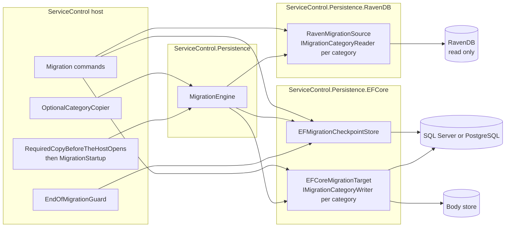
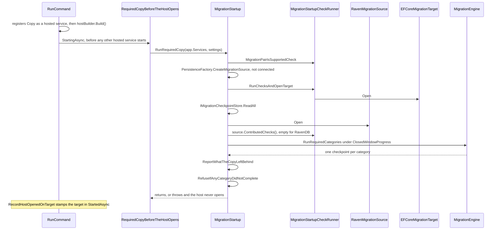

# Migration Engine: System Architecture Design

> [!NOTE]
> This build does not carry the whole migration yet. This page describes it as it will be when it ships.

[The overview](ravendb-to-sql-migration-overview.md) covers behaviour and guarantees. [The instructions](ravendb-to-sql-migration-instructions.md) cover the operator procedure. This page maps both onto types, call order and assembly boundaries.

> [!IMPORTANT]
> Startup check order and category order are load-bearing. Read the required copy and category sections before reordering checks or adding a category.

## Overview

```mermaid
flowchart LR
    subgraph host["ServiceControl host"]
        req["RequiredCopyBeforeTheHostOpens<br/>then MigrationStartup"]
        opt["OptionalCategoryCopier"]
        guard["EndOfMigrationGuard"]
        cmd["Migration commands"]
    end
    subgraph neutral["ServiceControl.Persistence"]
        eng["MigrationEngine"]
    end
    subgraph raven["ServiceControl.Persistence.RavenDB"]
        src["RavenMigrationSource<br/>IMigrationCategoryReader per category"]
    end
    subgraph ef["ServiceControl.Persistence.EFCore"]
        tgt["EFCoreMigrationTarget<br/>IMigrationCategoryWriter per category"]
        cp["EFMigrationCheckpointStore"]
    end
    req --> eng
    opt --> eng
    guard --> cp
    eng --> src
    eng --> tgt
    eng --> cp
    cmd --> cp
    cmd --> src
    cmd --> tgt
    src --> rdb[("RavenDB<br/>read only")]
    tgt --> sql[("SQL Server or PostgreSQL")]
    cp --> sql
    tgt --> bod[("Body store")]
```

`MigrationEngine` is store-agnostic. It drives `IMigrationSource` and `IMigrationTarget` per category and treats the cursor as an opaque string that it hands from source to target. Progress is persisted per category as a checkpoint row in the target database, committed in the same transaction as the rows it describes. Every command except `--migration-source-report` reads the checkpoint table.

## Assemblies

Dependencies point inward: each persister knows only its own store, the neutral assembly knows neither, and the host is the only composition root that names both.

| Assembly | Types | Boundary rationale |
| --- | --- | --- |
| `ServiceControl.Persistence` | `MigrationEngine`, `MigrationBodyLoader`. Contracts: `IMigrationSource`, `IMigrationTarget`, `IMigrationCheckpointStore`, `IMigrationStartupCheck`, `IMigrationTargetReadiness`, `IMigrationSourceFactory`. Data: `MigrationCategory`, `MigrationCategoryKind`, `MigrationCategoryIds`, `MigrationCategoryRegistry`, `MigrationBatch`, `MigrationRow`, `MigrationBody`, `MigrationCheckpoint`, `MigrationWriteResult`, `MigrationSkipReason`, `MigrationSourceDescription`, `MigrationSourceFact`. Rules: `MigrationCategoryStateExtensions`, `MigrationSkipReasonExtensions`, `MigrationCheckpointRules`, `HaltThreshold`. Options: `MigrationEngineOptions`, `MigrationSettings`. `MigrationCheckpointConflictException`. Read-only views: `MigrationStatusView`, `MigrationVerification`, `MigrationDryRunArithmetic` | Referenced by both persisters and the host, references neither persister, so the engine is unit-tested against in-memory fakes in `ServiceControl.UnitTests/Migration` |
| `ServiceControl.Persistence.RavenDB` | `RavenMigrationSource`, `RavenReadOnlySourceLifecycle`, `RavenDocumentStream`, `IMigrationCategoryReader`, `IWindowedMigrationCategoryReader`, one reader per category | Owns document id prefixes, sessions and the embedded server |
| `ServiceControl.Persistence.EFCore` | `EFCoreMigrationTarget`, `EFCoreMigrationTargetReadiness`, `IMigrationCategoryWriter`, `IStoreKeyedCategoryWriter`, one writer per category, `PreparedBatch`, `IMigrationSqlDialect`, `MigrationInsert`, `StoreKeyedInsert`, `EFMigrationCheckpointStore`, `MigrationCheckpointExtensions`, `EFCoreMigrationRowAssessor`, and the three target readiness checks | Owns tables, column widths and provider parameter limits |
| `ServiceControl` (host) | `RequiredCopyBeforeTheHostOpens`, `RecordHostOpenedOnTarget`, `MigrationStartup` with nested `ClosedWindowProgress`, `MigrationStartupCheckRunner`, the four host checks, `OptionalCategoryCopier`, `RequiredStartSourceOutage`, `MigrationComponent`, `EndOfMigrationGuard`, `FinishedCopyBeforeAnIngestionNodeOpens`, `MigrationProgressReporter`, the six migration commands with `MigrationOperatorCommands` and `MigrationSourceDescriptionPrinter`, `PersistenceFactory.CreateMigrationSource` and `OpenMigrationSource` | Pair support is the one question neither persister can answer, so it lives here |

Supporting assemblies:

- `SqlServerMigrationSqlDialect` and `PostgreSqlMigrationSqlDialect` implement `IMigrationSqlDialect` and are the only provider-specific migration code. SQL Server reads key-column collations in `Open` and inserts with `MERGE ... WITH (HOLDLOCK)`, de-duplicating the batch with `ROW_NUMBER() OVER (PARTITION BY <key> COLLATE <column collation>)`. PostgreSQL uses `INSERT ... ON CONFLICT DO NOTHING RETURNING`. Both implement `SetLicensingEndpointThroughput`. Each provider assembly carries its own `AddMigrationCheckpoints` EF migration and model snapshot, so a checkpoint schema change needs a migration in both.
- `ServiceControl.DomainEvents` holds `MigrationStarted`, `MigrationCategoryHalted`, `MigrationFinished` and `MigrationSourceUnreachable`.

The RavenDB persister registers no `IMigrationTarget`, `IMigrationTargetReadiness` or `IMigrationCheckpointStore`, so the guards below resolve `null` on RavenDB and return. `MigrationPairIsSupportedCheck` is what rejects RavenDB as a target.

## What runs on every SQL instance

These run whether or not `Migration/Enabled` is set. Each one closes a path to data loss or to a migration ending unnoticed.

- **Registrations.** `BasePersistence.RegisterDataStores`, reached through each provider's `AddPersistence`, registers `IMigrationCheckpointStore` as `EFMigrationCheckpointStore`, `IMigrationTargetReadiness` as `EFCoreMigrationTargetReadiness` and `IMigrationTarget` as `EFCoreMigrationTarget`, all singletons.
- **`EndOfMigrationGuard`.** With `Migration/Enabled` off, `RunCommand` registers a hosted service in place of `RequiredCopyBeforeTheHostOpens` that runs `MigrationStartup.RunEndOfMigrationGuard` in `StartingAsync`, before any other hosted service and before Kestrel binds. It reads every checkpoint row and refuses if any category `IsOutstanding`. `IMigrationTargetReadiness.HasHostOpened` only selects the refusal text: whether going back to RavenDB is still free. With no checkpoint store registered (RavenDB) it returns immediately.
- **`FinishedCopyBeforeAnIngestionNodeOpens`.** Registered by `ErrorIngestionOnlyCommand.BuildHost` on every ingestion-only host and by `ImportFailedErrorsCommand.BuildHost` on every SQL import, flag on or off. In `StartingAsync` it reads every checkpoint row, drops the rows the registry classifies as optional, and refuses unless every remaining row `IsFinished`. An id unknown to this build counts as required. The worker never copies: a single host owns the copy, because a second copier would race it on the checkpoint version.
- **`RecordHostOpenedOnTarget` on workers.** Every host that passes the ingestion gate also registers `RecordHostOpenedOnTarget`, flag on or off, and stamps `Migration/HostOpenedOnTarget` when checkpoint rows exist. Ingestion ends the free abort, so the end-of-migration guard must never offer a free abort after a worker has written.

The ingestion gate sees categories the copy never reached because `MigrationStartup.RunRequiredCategories` upserts a `NotStarted` row for every category without one before copying the first. `MigrationEngine.RunCategories` does the same for the background copy. Without those rows, a copy interrupted between two categories leaves only terminal rows and the gate passes. The gate cannot see a copy that has not written its first row.

> [!IMPORTANT]
> Workers must start only after the main host has opened. A worker started together with the first migration start can pass the gate before the first checkpoint row exists, and nothing enforces the order.

## The required copy

```mermaid
sequenceDiagram
    participant Run as RunCommand
    participant Copy as RequiredCopyBeforeTheHostOpens
    participant Start as MigrationStartup
    participant Checks as MigrationStartupCheckRunner
    participant Source as RavenMigrationSource
    participant Target as EFCoreMigrationTarget
    participant Engine as MigrationEngine

    Run->>Run: registers Copy as a hosted service, then hostBuilder.Build()
    Run->>Copy: StartingAsync, before any other hosted service starts
    Copy->>Start: RunRequiredCopy(app.Services, settings)
    Start->>Checks: MigrationPairIsSupportedCheck
    Start->>Start: PersistenceFactory.CreateMigrationSource, not connected
    Start->>Checks: RunChecksAndOpenTarget
    Checks->>Target: Open
    Start->>Start: IMigrationCheckpointStore.ReadAll
    Start->>Source: Open
    Start->>Checks: source.ContributedChecks(), empty for RavenDB
    Start->>Engine: RunRequiredCategories under ClosedWindowProgress
    Engine-->>Start: one checkpoint per category
    Start->>Start: ReportWhatTheCopyLeftBehind
    Start->>Start: RefuseIfAnyCategoryDidNotComplete
    Start-->>Copy: returns, or throws and the host never opens
    Note over Run: RecordHostOpenedOnTarget stamps the target in StartedAsync
```

Each position in the sequence is deliberate:

1. **Inside host start.** `RunCommand` registers `RequiredCopyBeforeTheHostOpens` only when `Migration/Enabled` is true, before `hostBuilder.Build()`. `app.RunAsync` drives its `StartingAsync` ahead of every other hosted service, so the retention sweeper, heartbeat settings sync, throughput collectors and the API cannot run while a required category is unfinished. Running inside `RunAsync` also keeps the Windows Service Control Manager's 30-second start timeout satisfied.
2. **`MigrationPairIsSupportedCheck` first.** It needs no source, target or options. It resolves `PersistenceType` through `PersistenceManifestLibrary` and checks it against `PersistenceFactory.SqlPersistenceNames`; the source type is fixed at `PersistenceFactory.MigrationSourcePersistenceType`. RavenDB with the flag on is rejected here.
3. **`PersistenceFactory.CreateMigrationSource`** resolves the source persistence and hard-casts its configuration to `IMigrationSourceFactory`, implemented only by `RavenPersistenceConfiguration`. A non-implementing persister fails with `InvalidCastException`. No I/O happens yet.
4. **`MigrationStartup.RunChecksAndOpenTarget`**, the target half, in order:
   - `OptionalCategoryWindowsAreValidCheck` runs `MigrationEngineOptions.FromSettings`, refusing a window that is not a non-negative `TimeSpan` and naming the key. A zero window removes the category from `SelectedOptionalCategoryIds`.
   - `RetryHistoryDepthIsSafeCheck` is host-owned because it needs only `Settings.RetryHistoryDepth`, which keeps that value off `PersistenceSettings` and out of `/api/configuration`.
   - `EFCoreMigrationTargetReadiness.ContributedChecks`: `SchemaIsCurrentCheck`, `TargetHoldsNoServiceControlDataCheck`, `BodyStorageIsWritableCheck`. The body probe is deleted after writing, so it does not skew body counts.
   - `IMigrationTarget.Open`, where the SQL Server dialect loads key-column collations.
   - `OptionalCategoryWindowsAreUnchangedCheck`, last because it reads checkpoint rows. It refuses a started, unfinished optional category whose configured window differs from `StartedWindowSeconds`.

   `MigrationStartupCheckRunner` short-circuits on the first refusal.
5. **`TargetHoldsNoServiceControlDataCheck`** passes immediately if a checkpoint row exists for any required category. Otherwise it refuses if any mapped table other than `MigrationCheckpoints` has a row, `Settings` included, naming tables by `GetTableName()` (`endpoint_settings`, `settings` on PostgreSQL).
6. **Source open, last.** It is the only step that can spawn a process. `RunRequiredCopy` reads the checkpoint rows and builds the engine first. `RavenReadOnlySourceLifecycle.Open` then:
   - starts the embedded server, if configured;
   - connects: on an external server it rejects an expired or not-yet-valid client certificate and an `https://` URL without one, then attaches `RefuseWrite` to the request pipeline before `Initialize`, so the version request is covered;
   - checks an external server's version against the client;
   - waits for both databases, with a 5-minute budget per database on an embedded server. The budget is only checked when RavenDB raises its own timeout, so the wait can exceed it.

   > [!IMPORTANT]
   > Readers must stream by id prefix, load by id, or query a static index. `RefuseWrite` blocks writes but passes query POSTs (`/queries`, `/multi_get`, `/streams/queries`), and a dynamic query creates an `Auto/` index. Only the embedded server sets `DisableAutoIndexCreation`.
7. **Source outage tolerance.** A failed source open is tolerated only when every required category already `IsFinished`. The host logs it, `MigrationStartup.RecordSourceOutage` writes the exception (inner exception when present) as `LastError` on each selected optional category still copying, creating `NotStarted` rows where absent, the copy is skipped and the host opens. `OptionalCategoryCopier` then stays idle for that start. In every other case the host refuses and writes nothing; if a required category never started, the refusal says the only exits are pointing back at RavenDB or starting over.
8. **`source.ContributedChecks()`** runs once the source is open, because such a check needs a session. `RavenMigrationSource` returns none, and a refusal here is never tolerated.
9. **`MigrationStartup.RunRequiredCategories`** upserts `NotStarted` rows, then runs each required category under its own linked `CancellationTokenSource`, awaited with `WaitAsync` on that token.
10. **`ClosedWindowProgress`** polls the checkpoint store every 30 seconds and logs progress. When the running category has committed nothing for 30 minutes, measured from the later of `LastProgressAt` and its run start, it cancels that category's token. `WaitAsync` returns even if the call underneath ignores cancellation, the category settles `Halted` with the stall in `LastError`, and the next category runs. The abandoned call keeps running until the host refuses and the process exits. A host shutdown leaves the row `InProgress`.
11. **`CopyOrExplainWhyItStopped`** maps `MigrationCheckpointConflictException` to a message about a second instance writing the same checkpoints.
12. **`ReportWhatTheCopyLeftBehind`** logs skips per category. It offers `--migration-retry` only for an `IsFailed` row, and reports harmless skips on a `Complete` row as harmless.
13. **`RefuseIfAnyCategoryDidNotComplete`** keeps the host closed. One message lists every Failed required category with stored state, counts, skips by reason (permanent reasons flagged as not retryable through `IsPermanent`), `LastError` and both commands. A Copying required category gets a line without a command. Rollback advice comes last.
14. **`RecordHostOpenedOnTarget`** is registered beside `RequiredCopyBeforeTheHostOpens` with the flag on. In `StartedAsync` it writes `Migration/HostOpenedOnTarget` the first time a host opens on a database that holds checkpoint rows, so the marker means "a host opened since the copy began", not "a host ran here once". The marker ends the free abort.

## The background copy

`OptionalCategoryCopier` is a `BackgroundService` registered by `MigrationComponent` only with the flag on and only on the main instance; `--error-ingestion-only` passes its own component list.

- Every 20 seconds it runs the optional categories in registry order, `EventLog` then `ArchivedAndResolvedFailedMessages`, skipping rows that are `IsFinished` or `IsFailed`.
- It opens its own source through `PersistenceFactory.OpenMigrationSource`, only when a category is still copying. On failure it calls `RecordSourceOutage` and idles for the rest of the start. It also idles when the required start already recorded an outage, which it learns from the in-process `RequiredStartSourceOutage` singleton (`Recorded`, `Error`) that `RunRequiredCopy` sets where it calls `RecordSourceOutage`. The checkpoint rows cannot carry this signal, because an optional row's `LastError` can survive from an earlier start.
- An exception leaves the category `InProgress` with `LastError`, untouched until the next start, so a transient failure never forces an abandon.

Windowing: `MigrationEngineOptions.WindowFor` supplies the window and the reader applies it through `IWindowedMigrationCategoryReader`. The engine writes `StartedWindowSeconds` once, on the first `InProgress` upsert. `CopiesFrom` is `StartedAt` minus the currently configured window, so window stability across restarts depends entirely on `OptionalCategoryWindowsAreUnchangedCheck`. Verify counts from `StartedAt` minus `StartedWindowSeconds` instead, which is the same window while the category copies, because nothing stops the setting changing once it has finished.

> [!IMPORTANT]
> Do not remove or reorder `OptionalCategoryWindowsAreUnchangedCheck`. The stored `StartedWindowSeconds` column does not protect the window by itself.

`Migration/ThrottlePauseMilliseconds` inserts a delay between optional-category batches, skipping the first batch of each category. Required categories are never throttled.

## Copying a batch

`MigrationEngine.RunCategoryAsync` is the per-category loop. Every store-specific step is delegated.

| Step | Owner | Rationale |
| --- | --- | --- |
| Load the checkpoint | `EFMigrationCheckpointStore.Read` | The table lives in the target database |
| Short-circuit terminal or Failed rows | `MigrationCategoryStateExtensions.IsFinished`, `IsFailed` | Single definition shared by every caller; the source is not read |
| Ordering | `MigrationCategory.MustFollow`, from `MigrationCategoryRegistry.All` | Data, not code. A follower whose predecessor is not `IsFinished` is upserted `Blocked` with `LastError` naming it |
| Start or resume | Engine: `NotStarted`, `Blocked`, or any row with `LastError` moves to `InProgress`, cursor kept | `Halted` never resumes by itself; only `--migration-retry` resets it |
| Batch size | `EFCoreMigrationTarget.BatchSizeFor` via the category's `IMigrationCategoryWriter` | Writers use `RowsPerStatementFor<TEntity>` from the dialect's parameter budget; `StoreKeyedInsert`-only writers use a fixed 500 |
| Read after cursor | `IMigrationCategoryReader`, usually via `RavenDocumentStream.ByPrefix`; single-document readers load by id; licensing settings readers use `LicensingSettingsSource` | No-tracking session. A cursor whose document no longer exists is refused, because RavenDB would otherwise resume after the missing id and skip rows. The cursor advances on every document seen |
| Fetch bodies | `MigrationBodyLoader` over `IMigrationSource.ReadBody` | Rows with a null body only, 8 concurrent, `MigrationEngine.MaxBodyReadAttempts` (3) with `MigrationEngineOptions.BodyRetryBackoff` (200 ms). `IsDefect` exceptions such as `NotSupportedException` are not retried and reach the batch catch. A missing attachment is skipped as `BodyUnreadable` after one attempt, since ingestion writes an attachment for every failed message. Body skips stay off the checkpoint until the write commits |
| Map documents to rows | `IMigrationCategoryWriter.Prepare`, returning `PreparedBatch` | Only the writer knows `NOT NULL` columns, key caps and what the product deletes anyway. Rows are inserted later inside the target transaction. Body-carrying writers write external bodies here, before the transaction, only for messages the target does not hold, so a crash leaves orphan bodies, never dangling references |
| Insert and checkpoint | `EFCoreMigrationTarget.Write`: `AccountForEveryRow`, then in one transaction under the execution strategy `PreparedBatch.Insert`, `AlreadyPresentIn`, `MigrationCheckpoint.Extend`, `MigrationCheckpointExtensions.UpsertCheckpoint` | Most writers use the dialect's `InsertMissing` built on `MigrationInsert`. Store-keyed rows use `StoreKeyedInsert`, because `MigrationInsert` rejects store-generated keys. Throughput days use `SetLicensingEndpointThroughput`. Each attempt clears the change tracker. Skips and merges are logged after commit, and `Extend` adds the batch's `PreparedBatch.Merges` to `MergedCount`. See [progress and checkpoints](ravendb-to-sql-migration-overview.md#progress-and-checkpoints) |
| Post-commit reconciliation | Engine compares `Write`'s saved checkpoint with the counts it restated | Mismatch settles `Halted`, either kind |
| Early stop | `HaltThreshold.Exceeded` on per-run counters | Fault skips (reasons not `IsBenign`, plus body skips) must exceed both `Migration/HaltThresholdPercent` and `Migration/HaltThresholdMinimum`. Counters are not persisted, so the threshold is per run |
| Settle | `MigrationEngine.Settle`, after `IMigrationTarget.Count` at the end of the source | Saves the category's SQL row count on the row it settles, as `TargetCountAtSettle`. A halt saves without it, because the target may be what failed, and `--migration-abandon` reads it later. Logs before saving, because the checkpoint store shares the target database and a failed save would hide the cause |

Body placement lives in `FailedMessagesWriter`, shared by `ArchivedAndResolvedFailedMessagesWriter`. `MessageBodyClassifier.Classify` decides placement and `FailedMessageRowMapper.SetBody` fills the columns: text up to `MaxBodySizeToStore` (100 KB default) inline; longer text inline prefix plus external copy; binary, invalid UTF-8 or NUL-containing text external only; empty bodies not stored. External writes go through `IBodyStoragePersistence.WriteBody`, which owns compression and the filesystem, Azure Blob or S3 backend, and complete before the transaction opens.

Invariants enforced across class boundaries:

- `MigrationCheckpoint.Extend` throws unless the per-`MigrationSkipReason` counts sum exactly to the skipped count. `EFCoreMigrationTarget.AccountForEveryRow` throws unless prepared rows plus skips equal the batch size, catching rows dropped during preparation. `AlreadyPresentIn` throws when a writer over-reports. Every row is copied, skipped or already present.
- `MigrationSkipReasonExtensions.IsBenign` is fixed: `PastRetention`, `BlankGroupComment`. Everything else is a fault, `Unknown` included.
- `PreparedBatch.Merges` reports rows whose key collides with another under the target's collation. `EndpointSettingsWriter` detects them with `IMigrationSqlDialect.KeyComparer` against the batch and the existing table, and `EFCoreMigrationTarget` logs one warning per merge naming both keys and the one kept. The dropped row counts as already present, and also in `MergedCount`, the part of already present that merges explain. Every writer whose key can fold two source rows into one reports them here, or `MergedCount` understates.
- `TargetCountAtSettle` is read with `IMigrationTarget.Count` just before the save that settles a category at the end of the source, or that abandons it, and is never updated afterwards. For a required category it is exactly what the copy left in SQL: the host is closed, `TargetHoldsNoServiceControlDataCheck` started the target empty, and a second copier would move the row's version so the settle save is refused. That is why the count needs no shared transaction with the save. For an optional category it also includes what ServiceControl wrote while the copy ran.

## Category states

`MigrationCategoryState` has seven stored values, surfaced as four operator states:

| Operator state | Stored | Meaning |
| --- | --- | --- |
| Copying | `NotStarted`, `InProgress`, `Blocked` | Not terminal, including a follower waiting on its predecessor and an optional category stopped by an error the next start retries |
| Done | `Complete` | Every row copied or benignly skipped, counts reconciled |
| Failed | `Halted`, `CompleteWithErrors` | Stays Failed until `--migration-retry` or `--migration-abandon` |
| Abandoned | `Abandoned` | Terminal, set by the operator directly or by cascade |

The required-copy refusal prints both forms for a Failed row (`EndpointSettings is Failed (Halted)`) and the stored state alone for a Copying row. Retry and abandon refusals print the operator state only.

Early stops during a run:

- Threshold exceeded or post-commit mismatch: `Halted`, either kind.
- Required category exception or 30-minute stall: `Halted`.
- Optional category exception: stays `InProgress` with `LastError`.

Settlement at end of source, in order:

1. Rows read this run differ from rows processed: `Halted`.
2. Any fault skip in the checkpoint: `CompleteWithErrors`.
3. Otherwise: `Complete`.

`MigrationCategoryStateExtensions.IsFinished` (`Complete` or `Abandoned`) and `IsFailed` (`Halted` or `CompleteWithErrors`) are the single definitions, used by the engine, the required-copy refusal, the background copier, the end-of-migration guard, the ingestion gate, status, verify and both operator commands. The host opens when every required category `IsFinished`; the migration is finished when every category is.

`MigrationCheckpointRules` holds the rules shared by the guard, the commands and status:

- `IsOutstanding`: not finished, except an optional `NotStarted` row whose window is `0`.
- `CanBeRetried`: an `IsFailed` row, or an optional `NotStarted` or `InProgress` row with `LastError` (which covers `RecordSourceOutage` rows). Never `Blocked` or a missing row. `MigrationOperatorCommands.Retry` rejects `EventLog` before consulting it.
- `CanBeAbandoned`: a required row that `IsFailed` or is `InProgress` with copied plus skipped plus already-present above 0, treating an id unknown to the registry as required; an optional category in any state except `Complete` or `Abandoned`, including no row.

Checkpoint schema: one row per category in `MigrationCheckpoints` (`migration_checkpoints` on PostgreSQL), primary key `CategoryId`. Columns: `State`, `Cursor`, `CopiedCount`, `SkippedCount`, `AlreadyPresentCount`, `MergedCount`, `SkipReasons` (JSON keyed by enum name; unknown names deserialize to `Unknown`, a fault), `StartedAt`, `LastProgressAt`, `SettledAt`, `LastError`, `StartedWindowSeconds`, `TargetCountAtSettle` (null until the category first settles) and `Version`, the optimistic concurrency token. No attempt counter and no decision record. `AddMigrationCheckpoints` creates the table in both providers and has not been released, so `TargetCountAtSettle` replaces the never-written `SourceTotal` column inside it, and `MergedCount` is added there too, rather than in a second migration. Run-level facts are `Settings` rows under `Migration/`, such as `Migration/HostOpenedOnTarget`.

## Commands

Every migration command except the source report builds a host with `AddPersistence` and never calls `StartAsync`, so no hosted service runs, including the retention sweeper and the integration event dispatcher. The source report builds no host and calls `PersistenceFactory.OpenMigrationSource` directly.

| Command | Class | Opens RavenDB | Reads and writes |
| --- | --- | --- | --- |
| `--migration-source-report` | `MigrationSourceReportCommand` | Yes | `IMigrationSource.Describe` and `Inventory` through `MigrationSourceDescriptionPrinter`; the copy never calls either. Each `MigrationSourceFact` carries its originating setting key. `Inventory` covers every collection, including uncopied ones |
| `--migration-dry-run` | `MigrationDryRunCommand`, `MigrationDryRunArithmetic` | Yes | `MigrationPairIsSupportedCheck`, then `MigrationStartup.RunChecksAndOpen` (both halves), so it refuses wherever a real start would. Reads `Count`, `Read`, `ReadBody`, `ReadBodyVolume`, `Inventory`, `Describe`, `IMigrationTarget.Assess` (via `EFCoreMigrationRowAssessor`) and `BatchSizeFor`. Writes no row; the body probe is the only write. Exit code 0 even when the report shows problems; a refused check throws |
| `--migration-status` | `MigrationStatusCommand`, `MigrationStatusView` | No | `IMigrationCheckpointStore.ReadAll` and `MigrationEngineOptions.FromSettings`. Read-only, safe while ServiceControl runs |
| `--migration-verify` | `MigrationVerifyCommand`, `MigrationVerification` | Yes | `ReadAll`, `FromSettings`, then `IMigrationSource.Count` per selected category, judged against the rows the copy read (below). A windowed category is counted from `CopiesFrom` set to `StartedAt` minus `StartedWindowSeconds`, the window the copy used, on the source side only. Never calls `IMigrationTarget.Count`. Streams every selected category, though not the bodies, so on an embedded source ServiceControl is stopped first. Exit code 1 only when a category `IsOutstanding`; rows never read on a Done category are reported, not failed |
| `--migration-retry <category>` | `MigrationRetryCommand`, `MigrationOperatorCommands` | No | `Retry` checks `CanBeRetried` and builds the reset row; `IMigrationTarget.ResetForRetry` persists it |
| `--migration-abandon <category>` | `MigrationAbandonCommand`, `MigrationOperatorCommands` | No | Checks `CanBeAbandoned`, then writes `Abandoned` rows through the checkpoint store only |

`MigrationOperatorCommands.Retry` builds the reset row without I/O: state `NotStarted`; `Cursor`, the four counts, `SkipReasons`, `SettledAt`, `TargetCountAtSettle` and `LastError` cleared; `StartedAt` and `StartedWindowSeconds` kept. Change retry semantics there. `ResetForRetry` only persists the row it receives, in one transaction under the execution strategy. Store-keyed categories cannot be re-read idempotently, so their writers implement `IStoreKeyedCategoryWriter.DeleteCopiedRows` and the reset deletes their rows in the same transaction:

- `RetryOperationsWriter`: `HistoricRetryOperations`, then `UnacknowledgedRetryOperations`.
- `PendingIntegrationEventsWriter`: `ExternalIntegrationDispatchRequests`.

Both are required categories, so the host has not opened and the target started empty. `EventLog` is also store-keyed but copies after the host opens, when its rows are indistinguishable from live ones, so it is abandon-only.

`--migration-abandon` first re-saves the named row unchanged, when it exists, to bump its version and fence off a concurrent copy. It then abandons dependants along `MigrationCategory.MustFollowIsDataLink` (`EndpointSettings` after `KnownEndpoints`, `LicensingThroughput` after `LicensingEndpoints`), deepest first, skipping `Complete` and `Abandoned` dependants and inserting `Abandoned` rows for dependants without one, and saves the named row last. `GroupComments` follows the unresolved failed messages for ordering only and is not cascaded. An optional category with no row gets a new `Abandoned` row. Every row it saves `Abandoned` carries `TargetCountAtSettle`, read just before the save, as a settle does. No domain event is raised, because ServiceControl is stopped.

Both operator commands rely on `MigrationCheckpointConflictException` to detect a race with a running copy.

`MigrationVerification` judges one thing per category: RavenDB now against the rows the copy read, `CopiedCount` plus `SkippedCount` plus `AlreadyPresentCount`. That sum is exactly the rows the last complete pass read, body skips included: `RunCategoryAsync` settles `Halted` when the rows a run read differ from the rows the target accounted for, a crash resume adds to the same totals, and a retry clears them. Once the source opens RavenDB only shrinks, because `RefuseWrite` refuses every client write and only RavenDB's expiry deletes.

- **RavenDB higher than the sum** is rows the copy never read. Verify flags them, by category.
- **RavenDB lower than the sum** is rows RavenDB removed after the copy read them, normal for the event log, the archive and a few unresolved messages with a stale expiry. Printed, not judged.
- **Expiry can hide the same number of unread rows** in the categories it touches, so a flagged number is a floor.
- **The count streams the same reader the copy used** (`RavenMigrationSource.Count`), so verify finds rows one run missed, such as a resume that skipped a range or a stream that ended early. It cannot find a reader that always misses the same rows, or a source pointed at the wrong database.
- **No live SQL count is compared with anything.** Once the host opens, normal use rewrites most categories' tables within minutes. `MergedCount` and `TargetCountAtSettle` are printed beside the sum instead.
- **An abandoned category's sum covers its last pass only.** Rows an earlier pass copied before a retry are in `TargetCountAtSettle` but not in the sum, so RavenDB minus the sum overstates what was never copied.

**Rows never read on a Done category are accepted, not fixed.** Verify prints `ROWS NOT READ`, names the category under the table and tells the operator to keep RavenDB, because those rows exist only there. The exit code ignores them, neither operator command takes a Done row, and nothing recounts RavenDB before the host opens: the misses verify can see are particular to one run and rare, and keeping RavenDB is the remedy.

## Readers and writers

Readers live at `ServiceControl.Persistence.RavenDB/DataMigration/Readers/<Category>Reader.cs` and are keyed in `RavenMigrationSource`'s reader dictionary. Writers live at `ServiceControl.Persistence.EFCore/DataMigration/Writers/<Category>Writer.cs` and are keyed in the `FrozenDictionary` initialised in `EFCoreMigrationTarget`. `MigrationCategoryCoverageTests` asserts that every registry category has both.

Every reader derives from `MigrationCategoryReader<TDocument>` and every writer from `MigrationCategoryWriter<TDocument>`, and the two for one category take the same `TDocument`, the type of each row's `Document`. The reader base streams whole documents from the primary database through `WholeDocuments`, and exposes `Lifecycle` to a reader that projects or reads the throughput database itself. The writer base casts every row once and hands `PrepareDocuments` the typed documents, so a row of another type fails the batch with an `InvalidCastException` naming the category, the row and both types. Four tests hold this: `MigrationCategoryCoverageTests.Every_reader_and_its_writer_agree_on_the_document_type`, `MigrationCategoryReadersTests.Every_reader_derives_from_the_typed_base`, `MigrationCategoryWritersTests.Every_writer_derives_from_the_typed_base` and `MigrationCategoryWritersTests.Every_writer_names_its_category_and_the_row_when_a_document_is_not_its_type`.

| Order | Category | Kind | Reader, writer | Notes |
| --- | --- | --- | --- | --- |
| 1 | `KnownEndpoints` | Required | `KnownEndpointsReader`, `KnownEndpointsWriter` | |
| 2 | `EndpointSettings` | Required | `EndpointSettingsReader`, `EndpointSettingsWriter` | Data link to `KnownEndpoints`. Copies every setting, including one for an unknown endpoint, which `HeartbeatEndpointSettingsSyncHostedService` removes once the host opens. Reports case merges on a case-insensitive name column |
| 3 | `MessageRedirects` | Required | `MessageRedirectsReader`, `MessageRedirectsWriter` | |
| 4 | `Subscriptions` | Required | `SubscriptionsReader`, `SubscriptionsWriter` | Rows differing only in message-type version merge |
| 5 | `NotificationSettings` | Required | `NotificationSettingsReader`, `NotificationSettingsWriter` | One `Settings` row via `SettingRowMapper` |
| 6 | `TrialEndDate` | Required | `TrialEndDateReader`, `TrialEndDateWriter` | One `Settings` row via `SettingRowMapper` |
| 7 | `RetryOperations` | Required | `RetryOperationsReader`, `RetryOperationsWriter` | Two tables: historic rows store-keyed via `StoreKeyedInsert`, unacknowledged rows via `InsertMissing`, which sizes the batch. Deletes its rows on retry |
| 8 | `LicensingEndpoints` | Required | `LicensingEndpointsReader`, `LicensingEndpointsWriter` | Throughput database |
| 9 | `LicensingThroughput` | Required | `LicensingThroughputReader`, `LicensingThroughputWriter` | Throughput database. Data link to `LicensingEndpoints`. `SetLicensingEndpointThroughput` sets each day's count rather than incrementing, so re-reads are idempotent |
| 10 | `LicensingReportMasks` | Required | `LicensingReportMasksReader`, `LicensingReportMasksWriter` | Throughput database via `LicensingSettingsSource`. One `Settings` row via `SettingRowMapper` |
| 11 | `LicensedEndpointDetails` | Required | `LicensedEndpointDetailsReader`, `LicensedEndpointDetailsWriter` | Throughput database via `LicensingSettingsSource`. One `Settings` row via `SettingRowMapper` |
| 12 | `UnresolvedAndRetryIssuedFailedMessages` | Required | `FailedMessagesReader`, `FailedMessagesWriter` | Carries bodies. `FailedMessageStream` projection, `FailedMessageRowMapper` |
| 13 | `PendingIntegrationEvents` | Required | `PendingIntegrationEventsReader`, `PendingIntegrationEventsWriter` | Store-keyed via `StoreKeyedInsert`. Deletes its rows on retry |
| 14 | `CustomChecks` | Required | `CustomChecksReader`, `CustomChecksWriter` | |
| 15 | `FailedErrorImports` | Required | `FailedErrorImportsReader`, `FailedErrorImportsWriter` | Carries bodies inline in `Read`, never calls `ReadBody` |
| 16 | `GroupComments` | Required | `GroupCommentsReader`, `GroupCommentsWriter` | Ordered after `UnresolvedAndRetryIssuedFailedMessages`, not a data link. Skips blanks as `BlankGroupComment` |
| 1 | `EventLog` | Optional | `EventLogReader`, `EventLogWriter` | Windowed, store-keyed, abandon-only. Skips as `PastRetention` |
| 2 | `ArchivedAndResolvedFailedMessages` | Optional | `ArchivedAndResolvedFailedMessagesReader`, `ArchivedAndResolvedFailedMessagesWriter` | Windowed, carries bodies, shares `FailedMessagesWriter` preparation. Skips as `PastRetention` |

## Progress reporting

There is no migration custom check: custom checks are being removed from ServiceControl, so progress uses the activity feed, the log and `--migration-status` only.

- `MigrationProgressReporter` raises `MigrationStarted`, `MigrationCategoryHalted` (for both Failed states), `MigrationFinished` (carrying `CategoriesAbandoned`) and `MigrationSourceUnreachable`, mapped into the ServicePulse activity feed by their `EventLogMappingDefinition` classes. It logs and swallows publish failures but propagates cancellation. All four are raised from `OptionalCategoryCopier`, so they cover the background copy only, and a Failed required category produces no activity-feed entry; its record is the startup refusal and the log.
- `MigrationSourceUnreachable` is raised once per start when `OptionalCategoryCopier` idles on a source outage, its own failed open or one the required start recorded, carrying the error and the optional categories left waiting.
- On its first pass, `OptionalCategoryCopier` logs a warning to set `Migration/Enabled` to `false` and restart when `MigrationCheckpointRules.FinishedButStillEnabled` holds: no registry category `IsOutstanding`. `--migration-status` prints the same line. `IsOutstanding` rather than `IsFinished`, so an optional category turned off with a `0` window does not hold the warning back.
- `ClosedWindowProgress` logs running required categories every 30 seconds while the host is closed.
- `--migration-status` reports state, progress, last error and available commands per category at any time, and whether migration can be turned off.
