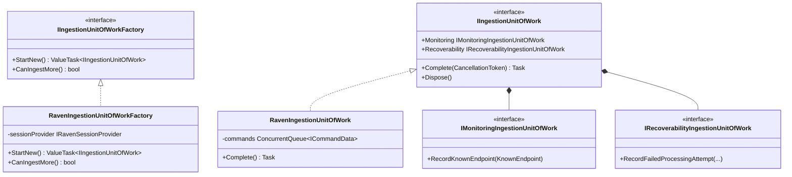

# ServiceControl Persistence Architecture

This document provides a deep dive into the persistence layer architecture in ServiceControl, intended to help understand how to implement alternative persistence providers (e.g., MongoDB).

## Architecture Overview

ServiceControl uses a plugin-based persistence architecture that allows different database backends to be swapped without changing the core application code. The architecture consists of:

| Component                  | Purpose                                                                           | Project                              |
|----------------------------|-----------------------------------------------------------------------------------|--------------------------------------|
| **Abstraction Layer**      | Interfaces defining the persistence contract                                      | `ServiceControl.Persistence`         |
| **Factory System**         | Dynamic loading of persistence implementations via manifests                      | `ServiceControl`                     |
| **Data Stores**            | Specialized interfaces for different data domains (errors, retries, monitoring)   | `ServiceControl.Persistence`         |
| **Unit of Work**           | Atomic batch operations for ingestion                                             | `ServiceControl.Persistence`         |
| **RavenDB Implementation** | Concrete implementation using RavenDB                                             | `ServiceControl.Persistence.RavenDB` |


### Instance Types

ServiceControl has three deployable instance types, each with its own persistence needs:

| Instance                      | Purpose                                                             | Supported Persistence |
|-------------------------------|---------------------------------------------------------------------|-----------------------|
| **ServiceControl** (Primary)  | Error handling, message retries, endpoint heartbeats, custom checks | RavenDB               |
| **ServiceControl.Audit**      | Audit message ingestion and querying                                | RavenDB, InMemory     |
| **ServiceControl.Monitoring** | Endpoint heartbeat collection                                       | InMemory              |


---

## Core Abstractions

The persistence layer is built on a set of core interfaces that define the contract between ServiceControl and any persistence implementation.


### IPersistence Interface

**File**: `src/ServiceControl.Persistence/IPersistence.cs`

```csharp
public interface IPersistence
{
    void AddPersistence(IServiceCollection services);
    void AddInstaller(IServiceCollection services);
}
```

This is the main entry point for a persistence implementation. The `AddPersistence` method registers all required services with the DI container.

### IPersistenceConfiguration Interface

**File**: `src/ServiceControl.Persistence/IPersistenceConfiguration.cs`

```csharp
public interface IPersistenceConfiguration
{
    PersistenceSettings CreateSettings(SettingsRootNamespace settingsRootNamespace);
    IPersistence Create(PersistenceSettings settings);
}
```

This interface is responsible for:

- Reading configuration and creating settings objects
- Creating the `IPersistence` implementation instance

### PersistenceSettings Base Class

**File**: `src/ServiceControl.Persistence/PersistenceSettings.cs`

```csharp
public abstract class PersistenceSettings
{
    public bool MaintenanceMode { get; set; }
    public string DatabasePath { get; set; }
    public bool EnableFullTextSearchOnBodies { get; set; }
}
```

Base class for persistence-specific settings. Each implementation extends this with its own configuration properties.

---

## Persistence Factory & Manifest System

### How Persistence is Loaded

**File**: `src/ServiceControl/Persistence/PersistenceFactory.cs`

The factory dynamically loads persistence implementations at runtime using a plugin manifest system:


Steps:

1. Reads `PersistenceType` from settings (e.g., "RavenDB")
2. Uses `PersistenceManifestLibrary.Find()` to locate the manifest file
3. Loads the assembly dynamically via `AssemblyLoadContextResolver`
4. Creates an instance of the `IPersistenceConfiguration` type
5. Returns the configured `IPersistence` implementation

### Persistence Manifest

**File**: `src/ServiceControl.Persistence/PersistenceManifest.cs`

Each persistence implementation has a JSON manifest file:

**Example**: `deploy/Particular.ServiceControl/Persisters/RavenDB/persistence.manifest`

```json
{
    "Name": "RavenDB",
    "DisplayName": "RavenDB",
    "Description": "RavenDB ServiceControl persister",
    "AssemblyName": "ServiceControl.Persistence.RavenDB",
    "TypeName": "ServiceControl.Persistence.RavenDB.RavenPersistenceConfiguration, ServiceControl.Persistence.RavenDB",
    "Aliases": [],
    "IsSupported": true
}
```

### Registration Flow


---

## RavenDB Implementation

### Key Files

| File                                                                          | Purpose                          |
|-------------------------------------------------------------------------------|----------------------------------|
| `src/ServiceControl.Persistence.RavenDB/RavenPersistenceConfiguration.cs`     | Configuration and factory        |
| `src/ServiceControl.Persistence.RavenDB/RavenPersisterSettings.cs`            | RavenDB-specific settings        |
| `src/ServiceControl.Persistence.RavenDB/RavenPersistence.cs`                  | Main IPersistence implementation |
| `src/ServiceControl.Persistence.RavenDB/IRavenPersistenceLifecycle.cs`        | Lifecycle management interface   |
| `src/ServiceControl.Persistence.RavenDB/RavenEmbeddedPersistenceLifecycle.cs` | Embedded RavenDB server          |
| `src/ServiceControl.Persistence.RavenDB/RavenExternalPersistenceLifecycle.cs` | External RavenDB connection      |
| `src/ServiceControl.Persistence.RavenDB/IRavenSessionProvider.cs`             | Session access                   |
| `src/ServiceControl.Persistence.RavenDB/DatabaseSetup.cs`                     | Database initialization          |

### RavenPersistence.AddPersistence()

This method registers all services:

```csharp
services.AddSingleton<PersistenceSettings>(settings);
services.AddSingleton(settings);
services.AddSingleton<IRavenSessionProvider, RavenSessionProvider>();
services.AddHostedService<RavenPersistenceLifecycleHostedService>();

// Data stores
services.AddSingleton<IBodyStorage, RavenAttachmentsBodyStorage>();
services.AddSingleton<IErrorMessageDataStore, ErrorMessagesDataStore>();
services.AddSingleton<ICustomChecksDataStore, RavenCustomCheckDataStore>();
services.AddSingleton<IMonitoringDataStore, RavenMonitoringDataStore>();
services.AddSingleton<IRetryBatchesDataStore, RetryBatchesDataStore>();
services.AddSingleton<IRetryDocumentDataStore, RetryDocumentDataStore>();
services.AddSingleton<IRetryHistoryDataStore, RetryHistoryDataStore>();
services.AddSingleton<IEventLogDataStore, EventLogDataStore>();
services.AddSingleton<IGroupsDataStore, GroupsDataStore>();
services.AddSingleton<IExternalIntegrationRequestsDataStore, ExternalIntegrationRequestsDataStore>();
services.AddSingleton<IEndpointSettingsStore, EndpointSettingsStore>();

// Unit of work
services.AddUnitOfWorkFactory<RavenIngestionUnitOfWorkFactory>();

// Lifecycle (embedded or external)
services.AddSingleton<IRavenPersistenceLifecycle>(...);
services.AddSingleton<IRavenDocumentStoreProvider>(...);
```

### Lifecycle Management

Two modes of operation:

1. **Embedded Mode** (`RavenEmbeddedPersistenceLifecycle`): Starts an in-process RavenDB server
2. **External Mode** (`RavenExternalPersistenceLifecycle`): Connects to an external RavenDB server via connection string


The lifecycle is managed via `IHostedService` through `RavenPersistenceLifecycleHostedService`.

---

## Document Models (Entities)

The persistence layer stores several key document types. Understanding these models is essential for implementing a new persistence provider.


### Primary Instance Documents

#### FailedMessage

**File**: `src/ServiceControl.Persistence/FailedMessage.cs`

```csharp
public class FailedMessage : IHaveStatus
{
    public string Id { get; set; }
    public List<ProcessingAttempt> ProcessingAttempts { get; set; }
    public List<FailureGroup> FailureGroups { get; set; }
    public string UniqueMessageId { get; set; }
    public FailedMessageStatus Status { get; set; }

    public class ProcessingAttempt
    {
        public Dictionary<string, object> MessageMetadata { get; set; }
        public FailureDetails FailureDetails { get; set; }
        public DateTime AttemptedAt { get; set; }
        public string MessageId { get; set; }
        public string Body { get; set; }
        public Dictionary<string, string> Headers { get; set; }
    }

    public class FailureGroup
    {
        public string Id { get; set; }
        public string Title { get; set; }
        public string Type { get; set; }
    }
}
```

#### RetryBatch

**File**: `src/ServiceControl.Persistence/RetryBatch.cs`

```csharp
public class RetryBatch
{
    public string Id { get; set; }
    public string Context { get; set; }
    public string RetrySessionId { get; set; }
    public string StagingId { get; set; }
    public string Originator { get; set; }
    public string Classifier { get; set; }
    public DateTime StartTime { get; set; }
    public DateTime? Last { get; set; }
    public string RequestId { get; set; }
    public int InitialBatchSize { get; set; }
    public RetryType RetryType { get; set; }
    public RetryBatchStatus Status { get; set; }
    public IList<string> FailureRetries { get; set; }
}
```

#### FailedMessageRetry

**File**: `src/ServiceControl.Persistence/FailedMessageRetry.cs`

```csharp
public class FailedMessageRetry
{
    public string Id { get; set; }
    public string FailedMessageId { get; set; }
    public string RetryBatchId { get; set; }
    public int StageAttempts { get; set; }
}
```

#### CustomCheck

**File**: `src/ServiceControl.Persistence/CustomCheck.cs`

```csharp
public class CustomCheck
{
    public string Id { get; set; }
    public string CustomCheckId { get; set; }
    public string Category { get; set; }
    public Status Status { get; set; }
    public DateTime ReportedAt { get; set; }
    public string FailureReason { get; set; }
    public EndpointDetails OriginatingEndpoint { get; set; }
}
```

#### KnownEndpoint

**File**: `src/ServiceControl.Persistence/KnownEndpoint.cs`

```csharp
public class KnownEndpoint
{
    public string HostDisplayName { get; set; }
    public bool Monitored { get; set; }
    public EndpointDetails EndpointDetails { get; set; }
}
```

### Audit Instance Documents

#### ProcessedMessage

**File**: `src/ServiceControl.Persistence/ProcessedMessage.cs`

```csharp
public class ProcessedMessage
{
    public string Id { get; set; }
    public string UniqueMessageId { get; set; }
    public Dictionary<string, object> MessageMetadata { get; set; }
    public Dictionary<string, string> Headers { get; set; }
    public DateTime ProcessedAt { get; set; }
}
```

---

## Data Store Interfaces

Each data store interface defines operations for a specific domain. A new persistence implementation must provide implementations for all these interfaces.


### Primary Instance Data Stores

| Interface                               | Purpose                                 | File                                                                      |
|-----------------------------------------|-----------------------------------------|---------------------------------------------------------------------------|
| `IErrorMessageDataStore`                | Error message queries and management    | `src/ServiceControl.Persistence/IErrorMessageDatastore.cs`                |
| `IRetryBatchesDataStore`                | Retry batch creation and staging        | `src/ServiceControl.Persistence/IRetryBatchesDataStore.cs`                |
| `IRetryDocumentDataStore`               | Retry session/batch document management | `src/ServiceControl.Persistence/IRetryDocumentDataStore.cs`               |
| `IRetryHistoryDataStore`                | Historical retry operation tracking     | `src/ServiceControl.Persistence/IRetryHistoryDataStore.cs`                |
| `ICustomChecksDataStore`                | Health check persistence                | `src/ServiceControl.Persistence/ICustomChecksDataStore.cs`                |
| `IMonitoringDataStore`                  | Endpoint monitoring state               | `src/ServiceControl.Persistence/IMonitoringDataStore.cs`                  |
| `IEventLogDataStore`                    | Event log item persistence              | `src/ServiceControl.Persistence/IEventLogDataStore.cs`                    |
| `IGroupsDataStore`                      | Failure grouping and forwarding         | `src/ServiceControl.Persistence/IGroupsDataStore.cs`                      |
| `IBodyStorage`                          | Message body storage/retrieval          | `src/ServiceControl.Operations.BodyStorage/IBodyStorage.cs`               |
| `IExternalIntegrationRequestsDataStore` | External integration event queue        | `src/ServiceControl.Persistence/IExternalIntegrationRequestsDataStore.cs` |
| `IEndpointSettingsStore`                | Per-endpoint configuration              | `src/ServiceControl.Persistence/IEndpointSettingsStore.cs`                |
| `INotificationsManager`                 | Notification settings                   | `src/ServiceControl.Persistence/INotificationsManager.cs`                 |

### Key Interface: IErrorMessageDataStore

**File**: `src/ServiceControl.Persistence/IErrorMessageDatastore.cs`

```csharp
public interface IErrorMessageDataStore
{
    // Query operations
    Task<QueryResult<IList<MessagesView>>> GetAllMessages(...);
    Task<QueryResult<IList<MessagesView>>> GetAllMessagesForEndpoint(...);
    Task<QueryResult<FailureGroupView>> GetFailureGroupView(...);
    Task<QueryResult<IList<FailureGroupView>>> GetFailureGroupsByClassifier(...);

    // Single item operations
    Task<QueryResult<FailedMessageView>> ErrorGet(...);
    Task<FailedMessage> ErrorLastBy(...);

    // Bulk operations
    Task FailedMessageMarkAsArchived(...);
    Task<bool> MarkMessageAsResolved(...);
    Task<int> UnArchiveMessages(...);
    Task<int> UnArchiveMessagesByRange(...);

    // Body retrieval
    Task<QueryResult<(string Body, string BodyUrl)>> FetchFromFailedMessage(...);
}
```

### Audit Instance Data Stores

| Interface             | Purpose                     | File                                                          |
|-----------------------|-----------------------------|---------------------------------------------------------------|
| `IAuditDataStore`     | Main audit query interface  | `src/ServiceControl.Audit.Persistence/IAuditDataStore.cs`     |
| `IBodyStorage`        | Message body storage        | `src/ServiceControl.Audit.Persistence/IBodyStorage.cs`        |
| `IFailedAuditStorage` | Failed audit import storage | `src/ServiceControl.Audit.Persistence/IFailedAuditStorage.cs` |

---

## Unit of Work Pattern

The Unit of Work pattern ensures atomic operations during message ingestion. All changes within a unit of work are committed together or rolled back entirely.




### Unit of Work Interfaces

**File**: `src/ServiceControl.Persistence/UnitOfWork/IIngestionUnitOfWork.cs`

```csharp
public interface IIngestionUnitOfWork : IDisposable
{
    IMonitoringIngestionUnitOfWork Monitoring { get; }
    IRecoverabilityIngestionUnitOfWork Recoverability { get; }
    Task Complete(CancellationToken cancellationToken);
}
```

**File**: `src/ServiceControl.Persistence/UnitOfWork/IIngestionUnitOfWorkFactory.cs`

```csharp
public interface IIngestionUnitOfWorkFactory
{
    ValueTask<IIngestionUnitOfWork> StartNew();
    bool CanIngestMore();
}
```

### RavenDB Implementation

**File**: `src/ServiceControl.Persistence.RavenDB/UnitOfWork/RavenIngestionUnitOfWork.cs`

The RavenDB unit of work:

- Batches commands in a `ConcurrentQueue<ICommandData>`
- Defers all commands to a single RavenDB session
- `Complete()` method executes all commands atomically
- Contains nested `RavenMonitoringIngestionUnitOfWork` and `RavenRecoverabilityIngestionUnitOfWork`

This ensures atomic ingestion - either all changes are persisted or none are.

---

## Index Definitions & Query Patterns

Understanding how RavenDB indexes work helps in designing equivalent query capabilities for alternative databases.


### Primary Instance Indexes

| Index                                          | Purpose                                      | File                                                                                             |
|------------------------------------------------|----------------------------------------------|--------------------------------------------------------------------------------------------------|
| `FailedMessageViewIndex`                       | Query failed messages with sorting/filtering | `src/ServiceControl.Persistence.RavenDB/Indexes/FailedMessageViewIndex.cs`                       |
| `FailureGroupsViewIndex`                       | Map/Reduce: Group failures by FailureGroup   | `src/ServiceControl.Persistence.RavenDB/Indexes/FailureGroupsViewIndex.cs`                       |
| `FailedMessages_ByGroup`                       | Map messages to groups for filtering         | `src/ServiceControl.Persistence.RavenDB/Indexes/FailedMessages_ByGroup.cs`                       |
| `RetryBatches_ByStatus_ReduceInitialBatchSize` | Map/Reduce: Aggregate retry batches          | `src/ServiceControl.Persistence.RavenDB/Indexes/RetryBatches_ByStatus_ReduceInitialBatchSize.cs` |
| `CustomChecksIndex`                            | Index custom checks by status/category       | `src/ServiceControl.Persistence.RavenDB/Indexes/CustomChecksIndex.cs`                            |

### Audit Instance Indexes

| Index               | Purpose                            | File                                                                        |
|---------------------|------------------------------------|-----------------------------------------------------------------------------|
| `MessagesViewIndex` | Full-text searchable message index | `src/ServiceControl.Audit.Persistence.RavenDB/Indexes/MessagesViewIndex.cs` |
| `SagaDetailsIndex`  | Multi-map index for saga history   | `src/ServiceControl.SagaAudit/SagaDetailsIndex.cs`                          |

### Query Extension Methods

**File**: `src/ServiceControl.Persistence/RavenQueryExtensions.cs`

```csharp
// Filtering
IncludeSystemMessagesWhere(bool includeSystemMessages)
FilterBySentTimeRange(DateTimeRange timeSentRange)

// Sorting (supports: id, message_id, message_type, critical_time,
//          delivery_time, processing_time, processed_at, status, time_sent)
Sort<TSource>(SortInfo sortInfo)

// Paging (offset-based with PageSize and Offset/Page)
Paging<TSource>(PagingInfo pagingInfo)
```

### Query Examples

```csharp
// Query all failed messages
session.Query<MessagesViewIndex.SortAndFilterOptions, MessagesViewIndex>()
    .IncludeSystemMessagesWhere(includeSystemMessages)
    .FilterBySentTimeRange(timeSentRange)
    .Statistics(out var stats)
    .Sort(sortInfo)
    .Paging(pagingInfo)
    .OfType<FailedMessage>()
    .TransformToMessageView()

// Full-text search
session.Query<MessagesViewIndex.SortAndFilterOptions>(indexName)
    .Search(x => x.Query, searchParam)
    .FilterBySentTimeRange(timeSentRange)
    .Sort(sortInfo)
    .Paging(pagingInfo)
    .ToMessagesView()
```

### Query Infrastructure Models

| Model            | Purpose                    | File                                                              |
|------------------|----------------------------|-------------------------------------------------------------------|
| `PagingInfo`     | Offset-based pagination    | `src/ServiceControl.Persistence/Infrastructure/PagingInfo.cs`     |
| `SortInfo`       | Sort field and direction   | `src/ServiceControl.Persistence/Infrastructure/SortInfo.cs`       |
| `DateTimeRange`  | Optional From/To filtering | `src/ServiceControl.Persistence/Infrastructure/DateTimeRange.cs`  |
| `QueryResult<T>` | Results with stats         | `src/ServiceControl.Persistence/Infrastructure/QueryResult.cs`    |
| `QueryStatsInfo` | ETag and total results     | `src/ServiceControl.Persistence/Infrastructure/QueryStatsInfo.cs` |

---

## InMemory Implementation (Reference)

The Audit instance has an InMemory implementation that serves as an excellent reference for understanding the persistence contract.

### InMemoryPersistence

**File**: `src/ServiceControl.Audit.Persistence.InMemory/InMemoryPersistence.cs`

```csharp
public class InMemoryPersistence(PersistenceSettings persistenceSettings) : IPersistence
{
    public void AddPersistence(IServiceCollection services)
    {
        services.AddSingleton<InMemoryAuditDataStore>();
        services.AddSingleton<IAuditDataStore>(sp => sp.GetRequiredService<InMemoryAuditDataStore>());
        services.AddSingleton<IBodyStorage, InMemoryAttachmentsBodyStorage>();
        services.AddSingleton<IFailedAuditStorage, InMemoryFailedAuditStorage>();
        services.AddSingleton<IAuditIngestionUnitOfWorkFactory, InMemoryAuditIngestionUnitOfWorkFactory>();
    }
}
```

### InMemoryAuditDataStore

**File**: `src/ServiceControl.Audit.Persistence.InMemory/InMemoryAuditDataStore.cs`

Uses simple in-memory collections with LINQ queries:

```csharp
class InMemoryAuditDataStore : IAuditDataStore
{
    List<MessagesView> messageViews;
    List<ProcessedMessage> processedMessages;
    List<SagaHistory> sagaHistories;
    IBodyStorage bodyStorage;
    public List<KnownEndpoint> knownEndpoints;
    public List<FailedAuditImport> failedAuditImports;
}
```

This implementation demonstrates all the query patterns using pure LINQ-to-Objects, making it very transparent and useful as a reference.

---

## Data Flow: Error Message Lifecycle

Understanding the data flow helps in ensuring the persistence implementation handles all scenarios correctly.


---

## Configuration & Settings

### RavenDB Configuration Keys

**File**: `src/ServiceControl.Persistence.RavenDB/RavenBootstrapper.cs`

| Key                                      | Default                 | Purpose                     |
|------------------------------------------|-------------------------|-----------------------------|
| `DbPath`                                 | `.db` relative to exe   | Embedded database directory |
| `RavenDB/ConnectionString`               | (empty)                 | External server URL         |
| `DatabaseMaintenancePort`                | 33334                   | Embedded server HTTP port   |
| `RavenDB/DatabaseName`                   | "primary"               | Main database name          |
| `ExpirationProcessTimerInSeconds`        | 600                     | TTL cleanup frequency       |
| `MinimumStorageLeftRequiredForIngestion` | (varies)                | Storage space threshold     |
| `ErrorRetentionPeriod`                   | (required)              | Data retention duration     |
| `RavenDB/ClientCertificatePath`          | (empty)                 | Client certificate file     |
| `RavenDB/ClientCertificateBase64`        | (empty)                 | Base64-encoded certificate  |
| `RavenDB/ClientCertificatePassword`      | (empty)                 | Certificate password        |
| `LogPath`                                | `.logs` relative to exe | Embedded server logs        |
| `RavenDBLogLevel`                        | "Warn"                  | Embedded server log level   |

---

## Implementing a New Persistence Provider

To implement a new persistence provider (e.g., MongoDB), you need to create several components that work together.


### 1. Create the Project Structure

```text
src/
├── ServiceControl.Persistence.MongoDB/
│   ├── MongoDbPersistenceConfiguration.cs    # IPersistenceConfiguration
│   ├── MongoDbPersisterSettings.cs           # Settings class
│   ├── MongoDbPersistence.cs                 # IPersistence implementation
│   ├── MongoDbLifecycle.cs                   # Database lifecycle
│   ├── DataStores/
│   │   ├── ErrorMessagesDataStore.cs         # IErrorMessageDataStore
│   │   ├── RetryBatchesDataStore.cs          # IRetryBatchesDataStore
│   │   └── ... (other data stores)
│   └── UnitOfWork/
│       ├── MongoDbIngestionUnitOfWork.cs
│       └── MongoDbIngestionUnitOfWorkFactory.cs
```

### 2. Create the Manifest File

**File**: `deploy/Particular.ServiceControl/Persisters/MongoDB/persistence.manifest`

```json
{
    "Name": "MongoDB",
    "DisplayName": "MongoDB",
    "Description": "MongoDB ServiceControl persister",
    "AssemblyName": "ServiceControl.Persistence.MongoDB",
    "TypeName": "ServiceControl.Persistence.MongoDB.MongoDbPersistenceConfiguration, ServiceControl.Persistence.MongoDB",
    "Aliases": ["Mongo"],
    "IsSupported": true
}
```

### 3. Implement Core Interfaces

1. **`IPersistenceConfiguration`**: Configuration and factory
2. **`IPersistence`**: Service registration
3. **Settings class** extending `PersistenceSettings`
4. **Lifecycle management** (database connection, initialization)

### 4. Implement Data Stores

Implement all required data store interfaces:

- `IErrorMessageDataStore`
- `IRetryBatchesDataStore`
- `IRetryDocumentDataStore`
- `ICustomChecksDataStore`
- `IMonitoringDataStore`
- `IEventLogDataStore`
- `IGroupsDataStore`
- `IBodyStorage`
- `IExternalIntegrationRequestsDataStore`
- `IEndpointSettingsStore`
- `INotificationsManager`
- `IRetryHistoryDataStore`

### 5. Implement Unit of Work

Create implementations for:

- `IIngestionUnitOfWork`
- `IIngestionUnitOfWorkFactory`
- `IMonitoringIngestionUnitOfWork`
- `IRecoverabilityIngestionUnitOfWork`

### 6. Database Design Considerations

When designing the MongoDB collections, consider:

1. **Document storage**: MongoDB's document model naturally maps to entities with nested collections (e.g., `FailedMessage.ProcessingAttempts`)
2. **Full-text search**: Use MongoDB text indexes or Atlas Search for message body/header searching
3. **Aggregations**: Use MongoDB aggregation pipelines to replicate RavenDB Map/Reduce indexes (e.g., failure groups)
4. **TTL/Expiration**: Use MongoDB TTL indexes for automatic document expiration
5. **Atomic operations**: Use MongoDB transactions for unit of work semantics
6. **Concurrent access**: Data stores must be thread-safe; leverage MongoDB's concurrency controls

### Key Files to Reference

| File                                                                       | Why It's Useful                     |
|----------------------------------------------------------------------------|-------------------------------------|
| `src/ServiceControl.Audit.Persistence.InMemory/`                           | Complete alternative implementation |
| `src/ServiceControl.Persistence.RavenDB/RavenPersistence.cs`               | Full service registration example   |
| `src/ServiceControl.Persistence/`                                          | All interface definitions           |
| `deploy/Particular.ServiceControl/Persisters/RavenDB/persistence.manifest` | Manifest format                     |

---

## File Structure Summary

```text
src/
├── ServiceControl.Persistence/                    # Abstraction layer
│   ├── IPersistence.cs
│   ├── IPersistenceConfiguration.cs
│   ├── PersistenceSettings.cs
│   ├── PersistenceManifest.cs
│   ├── IErrorMessageDatastore.cs
│   ├── IRetryBatchesDataStore.cs
│   ├── ICustomChecksDataStore.cs
│   ├── ... (other interfaces)
│   ├── Infrastructure/
│   │   ├── PagingInfo.cs
│   │   ├── SortInfo.cs
│   │   ├── DateTimeRange.cs
│   │   └── QueryResult.cs
│   └── UnitOfWork/
│       ├── IIngestionUnitOfWork.cs
│       └── IIngestionUnitOfWorkFactory.cs
│
├── ServiceControl.Persistence.RavenDB/            # RavenDB implementation
│   ├── RavenPersistenceConfiguration.cs
│   ├── RavenPersisterSettings.cs
│   ├── RavenPersistence.cs
│   ├── IRavenPersistenceLifecycle.cs
│   ├── RavenEmbeddedPersistenceLifecycle.cs
│   ├── RavenExternalPersistenceLifecycle.cs
│   ├── IRavenSessionProvider.cs
│   ├── RavenSessionProvider.cs
│   ├── DatabaseSetup.cs
│   ├── ErrorMessagesDataStore.cs
│   ├── ... (other data stores)
│   ├── Indexes/
│   │   ├── FailedMessageViewIndex.cs
│   │   ├── FailureGroupsViewIndex.cs
│   │   └── ... (other indexes)
│   └── UnitOfWork/
│       ├── RavenIngestionUnitOfWork.cs
│       └── RavenIngestionUnitOfWorkFactory.cs
│
├── ServiceControl.Audit.Persistence/              # Audit abstraction layer
├── ServiceControl.Audit.Persistence.RavenDB/      # Audit RavenDB implementation
├── ServiceControl.Audit.Persistence.InMemory/     # Audit InMemory implementation (reference)
│
└── ServiceControl/
    └── Persistence/
        ├── PersistenceFactory.cs                  # Dynamic loading
        └── PersistenceServiceCollectionExtensions.cs
```

---

> **Related Documentation**: See [Cloud-Native Storage Options](cloud-native-storage-options.md) for detailed analysis of alternative database options including MongoDB Atlas, Azure Cosmos DB, and PostgreSQL.
