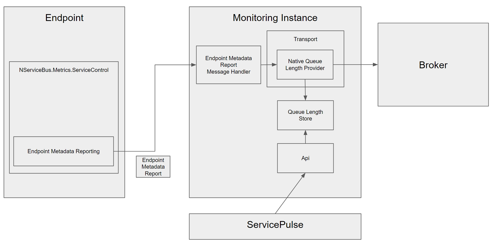
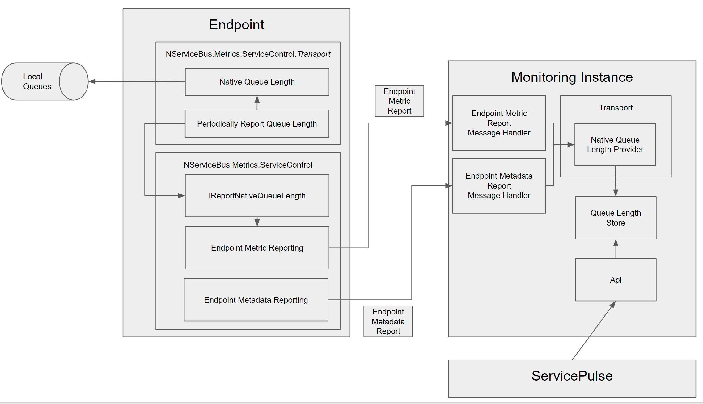

The queue length metric is calculated differently depending on whether the transport uses a centralized broker or is federated.

In both cases, the endpoint plugin will collect some data and report to a transport specific queue length provider in the Monitoring Instance. The native queue length provider will write data to a queue length store which is queried by the api servicing ServicePulse.

There are two types of information that the endpoint plugin can send:
- Endpoint Metadata Report
- Endpoint Metric Report

The Endpoint Metadata Report contains a list of all of the queues that an endpoint is reading from. Every endpoint running the NServiceBus.Metrics.ServiceControl plugin sends this type of information.

The Endpoint Metric Report contains an actual list of queue lengths, as measured by the endpoint. The NServiceBus.Metrics.ServiceControl plugin exposes a way to report this information. For this data to be reported, an additional plugin is required at the endpoint (see for example, NServiceBus.Metrics.ServiceControl.Msmq).

## Centralized Approach

In the centralized approach, only the Endpoint Metadata Report is needed. The Queue length Provider is expected to use this information to connect to the broker and query for queue lengths. The Queue Length Store should be periodically updated with this information (as often as makes sense for the transport). 

To create a Native Queue Length provider, create a new class in the ServiceControl Transport Assembly that implements `IProvideNativeQueueLength`. This class should have a default constructor and is created by the Monitoring Instance at startup when the transport is configured. This interface contains methods to initialize, start, stop the provider as well as accepting both types of Endpoint Report. 

If no Native Queue Length provider is found within the Transport Assembly of the selected transport, then the Default Queue Length Provider is used. This implementation simply routes incoming Endpoint Metric Report messages directly to the queue length store. It is suitable for transports that use the Decentralized approach (see below). 

### Initialization

When the native queue length privider has been created it will be initialized with a call to `Initialize(string connectionString, QueueLengthStore store)`. The provided connection string is the one that the Monitoring Instance uses to connect to the transport. It is expected that the queue length provider will manage it's own connection.

### Reference Implementation

The reference implementation for the Centralized approach is the [SQL Transport Queue Length Provider](https://github.com/Particular/ServiceControl.Monitoring/blob/develop/src/ServiceControl.Transports.SQLServer/QueueLengthProvider.cs)

## Decentralized

In the decentralized approach, an additional plugin is installed at the endpoint on top of the NServiceBus.Metrics.ServiceControl plugin. This plugin gets a list of queues to monitor and should periodically report their lengths using the interface exposed by the metrics plugin (`IReportNativeQueueLength`).

The Native Queue Length Provider in the Monitoring Instance can ignore the Endpoint Metadata Report and simply pass the details of the Endpoint Metric Report directly into the store when it arrives. This is the behavior of the default queue length provider implementation. 

The reference implemenation for the Decentralized approach is the [MSMQ Transport Queue Length Plugin](https://github.com/Particular/nservicebus.metrics.servicecontrol.msmq).