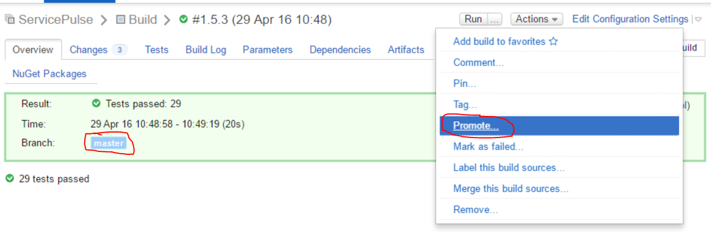
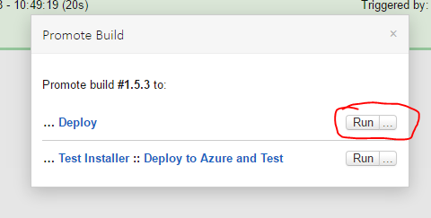
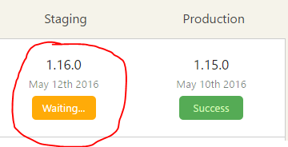

## ServiceControl releasing procedure

### 1. Merge change
ServiceControl uses [githubflow for versioning](http://gitversion.readthedocs.io/en/latest/git-branching-strategies/githubflow/), so there is no `develop` branch.
So any fix/feature is worked on a branch/PR (there is no convention for naming these branches) and those get merged directly into `master`.

By default a merge directly into master is considered a `patch` increment, if u want to up the `minor` or `major`, you merge the PR to a `release branch` (read section "Branch name" in http://gitversion.readthedocs.io/en/latest/more-info/version-increments/) and then merge that to `master`, or alternative u can set the `next-version` (read section "GitVersion.yml" in http://gitversion.readthedocs.io/en/latest/more-info/version-increments/) in the [yaml file](https://github.com/Particular/ServiceControl/blob/master/gitversionconfig.yaml).

### 2. Build using TeamCity
Once you have your change merged into `master` (AVOID BUNDLING CHANGES, RELEASE OFTEN INSTEAD) and the [build is green](https://builds.particular.net/project.html?projectId=ServicePulse) it is time to "Promote" the master build to "Deploy".

### 3. Deploy using OctopusDeploy
You are now ready to go to [OctopusDeploy](http://deploy.particular.net/app#/projects/servicepulse).
You should have a new "Staging" build waiting to be released.  

First step is to proof read the release notes that were auto generated (it is best to use an outsider for this job).  

This release notes are generated based on the issues/PRs titles associated to a milestone that matches the version you are about to release, see [how release notes are generated](https://github.com/Particular/ServiceControl/blob/master/docs/Release%20Notes.md).  

**NOTE**: Ensure all issues/PRs are closed, otherwise they are not included in the release notes.

Once you happy approve them:  

And then all is left to do is "Promote to Production".  

