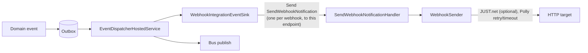

# Webhook notifications design

## What it is

The error instance can push alerts to HTTP webhooks so that incident response tools (Prometheus Alertmanager, Grafana OnCall, PagerDuty, incident.io, Rootly, …) learn about problems without polling ServicePulse. A webhook fires when a message fails, an endpoint stops sending heartbeats, or a custom check fails, and it resolves when the problem goes away.

The default body is a [Prometheus Alertmanager v2](https://github.com/prometheus/alertmanager/blob/main/api/v2/openapi.yaml) `postableAlerts` JSON array. Targets that expect a different schema get a per-webhook [JUST.net](https://github.com/WorkMaze/JUST.net) template that reshapes that array before it is sent.

Only the primary (error) instance sends webhooks, and an ingestion-only worker sends none.

## Configuration

| Setting | Meaning |
| --- | --- |
| `ServiceControl/Webhooks` | JSON array of webhook targets. Empty or absent disables the feature. |
| `ServiceControl/ServicePulseUrl` | Optional absolute ServicePulse URL. When set, alerts carry deep links (`generatorURL`, `servicepulse_url`). |

Each target:

| Property | Required | Meaning |
| --- | --- | --- |
| `Url` | yes | Absolute `http` or `https` URL. |
| `Name` | no | Used in logs and the event log. Defaults to `webhook-<position>`. Must be unique. |
| `Headers` | no | Object of header name to value, e.g. `Authorization`. CR/LF in values is rejected. |
| `Template` | no | JUST.net template, either a JSON object or a string containing JSON. |
| `Alerts` | no | Subset of `MessageFailed`, `HeartbeatStopped`, `CustomCheckFailed`. Defaults to all. |

```json
[
  {
    "Name": "alertmanager",
    "Url": "https://alertmanager.example.com/api/v2/alerts",
    "Headers": { "Authorization": "Bearer …" }
  },
  {
    "Name": "pagerduty",
    "Url": "https://events.pagerduty.com/v2/enqueue",
    "Alerts": [ "MessageFailed", "HeartbeatStopped" ],
    "Template": {
      "routing_key": "R0UT1NGK3Y",
      "event_action": "#ifcondition(#exists($[0].endsAt),true,resolve,trigger)",
      "dedup_key": "#valueof($[0].annotations.dedup_key)",
      "payload": {
        "summary": "#valueof($[0].annotations.summary)",
        "source": "#valueof($[0].labels.endpoint)",
        "severity": "#valueof($[0].labels.severity)",
        "timestamp": "#valueof($[0].startsAt)",
        "custom_details": "#valueof($[0].annotations)"
      },
      "links": [ { "href": "#valueof($[0].generatorURL)", "text": "Open in ServicePulse" } ]
    }
  }
]
```

The configuration is validated at startup, and an invalid webhook prevents the instance from starting, the same as any other invalid setting. The exception is a template that is not a JSON object or uses `#customfunction`: it is logged as an error at startup and every delivery to that webhook fails (see below) until it is fixed, so one bad template does not take the instance down. Error messages never include the URL, because URLs can contain secrets. Webhook URLs, headers and templates are excluded from the serialized settings because they routinely contain secrets.

## The default payload

Each alert separates **identity** (`labels`, which decide whether two notifications concern the same problem) from **context** (`annotations`, which are free to change).

| Alert | `alertname` | `severity` | Identity labels |
| --- | --- | --- | --- |
| Failed message | `MessageFailed` | `error` | `endpoint`, `message_type`, `failed_message_id` |
| Heartbeat | `HeartbeatStopped` | `critical` | `endpoint`, `host`, `host_id` |
| Custom check | `CustomCheckFailed` | `warning` | `endpoint`, `host`, `host_id`, `custom_check_id`, `category` |

Every alert also carries the `servicecontrol_instance` label. Every alert's annotations include `summary`, plus `description` and `servicepulse_url` when available, and `dedup_key`: a stable hash of the labels for receivers that need a single correlation key. Failed-message alerts add `exception_type`, `exception_message`, `failing_address`, `host`, `sending_endpoint`, `message_id` and `processing_attempts`. Heartbeat alerts add `last_heartbeat_at`, and custom-check alerts add `failure_reason`. Long text is truncated to 1000 characters.

## Lifecycle

A firing alert carries `startsAt` and no `endsAt`. A resolving alert carries **the same labels** and an `endsAt`, so the receiver closes the alert it already holds.

| Fires on | Resolves on |
| --- | --- |
| `MessageFailed` (not archived), `FailedMessagesUnArchived` | `MessageFailureResolvedByRetry`, `MessageFailureResolvedManually`, `MessageEditedAndRetried`, `FailedMessagesArchived` |
| `HeartbeatStopped` | `HeartbeatRestored` |
| `CustomCheckFailed` | `CustomCheckSucceeded` |

Failed-message resolution events carry only IDs and can be stale by the time they are dispatched, so the current state of the failed message decides the outcome. A message that has failed again since it was retried is not resolved. When one alert changes state more than once in the same batch, only its latest state is sent.

## How it works

Webhooks reuse the durable external-integrations outbox that already backs the `ServiceControl.Contracts` bus events. The outbox is enabled when either bus publishing or at least one webhook is configured. `DisableExternalIntegrationsPublishing` turns off bus publishing only.



The dispatcher does no HTTP work. A failing callback there retries the whole batch and eventually trips a critical error, so the sink only maps events to alerts and sends one `SendWebhookNotification` command per webhook to the instance's own queue. That isolates targets from each other and from the outbox.

A webhook without a template receives up to 25 alerts per request. A templated webhook receives one alert per request, so templates can address `$[0]`.

## Delivery and failures

- Requests are `POST` with `Content-Type: application/json`, the configured headers, and a `ServiceControl/<version>` user agent unless a `User-Agent` header is configured.
- Each attempt times out after 10 seconds. Network errors, timeouts, HTTP 408, 429 and 5xx are retried 3 times with exponential backoff and jitter, honouring `Retry-After` up to 15 seconds. Delayed delivery is unavailable on ServiceControl's transports, so retries happen inside the handler.
- Delivery is **at least once with no ordering guarantee** between commands, so receivers must deduplicate by labels or `dedup_key`.
- A non-transient status (e.g. 400 or 401), exhausted retries, or a template that fails or does not produce JSON is logged with the webhook name and alert names, and recorded in the event log as `WebhookNotificationFailed`. The message is then consumed rather than sent to the error queue, so one broken target cannot generate failed messages about itself.

## Templates and security

Templates are trusted administrator configuration and run in-process. To keep event data from becoming code:

- `#customfunction`, which can invoke arbitrary .NET methods, is rejected, including attempts to assemble it at runtime.
- JUST.net re-evaluates any string value starting with `#`, so a failed message's exception text could otherwise inject template functions. String values in the input are neutralized before transformation and restored afterwards.

## Known limits

- **Alertmanager auto-resolves silent alerts.** Firing alerts have no `endsAt`, so Alertmanager resolves them after its `resolve_timeout` (5 minutes by default) unless they are re-sent. ServiceControl does not re-send, so raise `resolve_timeout` on the receiving Alertmanager or route through a tool that keeps alerts open until resolved.
- **No backfill.** Problems that existed before a webhook was configured are not sent.
- **Outbox semantics apply.** Events are dispatched after their transaction commits. An outage of the error instance delays notifications but does not lose them.
